---
## Front matter
lang: ru-RU
title: Лабораторная работа №1
author:
  - Бондарь Т. В.
institute:
  - Российский университет дружбы народов, Москва, Россия
  
## i18n babel
babel-lang: russian
babel-otherlangs: english

## Formatting pdf
toc: false
toc-title: Содержание
slide_level: 2
aspectratio: 169
section-titles: true
theme: metropolis
header-includes:
 - \metroset{progressbar=frametitle,sectionpage=progressbar,numbering=fraction}
 - '\makeatletter'
 - '\beamer@ignorenonframefalse'
 - '\makeatother'
---

# Информация

## Докладчик

:::::::::::::: {.columns align=center}
::: {.column width="70%"}

  * Бондарь Татьяна Владимировна
  * НКАбд-01-24, студ. билет №1132246711
  * Российский университет дружбы народов
  * <https://github.com/tvbondar/study_2024-2025_os-intro>

:::
::: 
:::
::::::::::::::

# Выполнение лабораторной работы №1

## Цели работы

Целью данной работы является приобретение практических навыков установки операционной системы на виртуальную машину, настройки минимально необходимых для дальнейшей работы сервисов.

## Задачи

1) Запуск VirtualBox и создание новой виртуальной машины (операционная система Linux, Fedora).
2) Настройка установки ОС.
3) Перезапуск виртуальной машины и установка драйверов для VirtualBox.
4) Подключение образа диска дополнений гостевой ОС.
5) Установка необходимого ПО для создания документации.
6) Выполнение домашнего задания.

## Теоретическое введение

Операционная система - это комплекс взаимосвязанных программ, который действует как интерфейс между приложениями и пользователями с одной стороны и аппаратурой компьютера с другой стороны. VirtualBox - это специальное средство для виртуализации, позволяющее запускать операционную систему внтури другой. С помощью VirtualBox мы можем также настраивать сеть, обмениваться файлами и делать многое другое.

## Выполнение лабораторной работы

## Создание виртуальной машины

1. Создаем новую виртуальную машину, указываем имя. Указываем размер основной памяти, задаем размер диска. Добавляем новый привод оптических дисков и выбираем образ операционной системы Fedora.

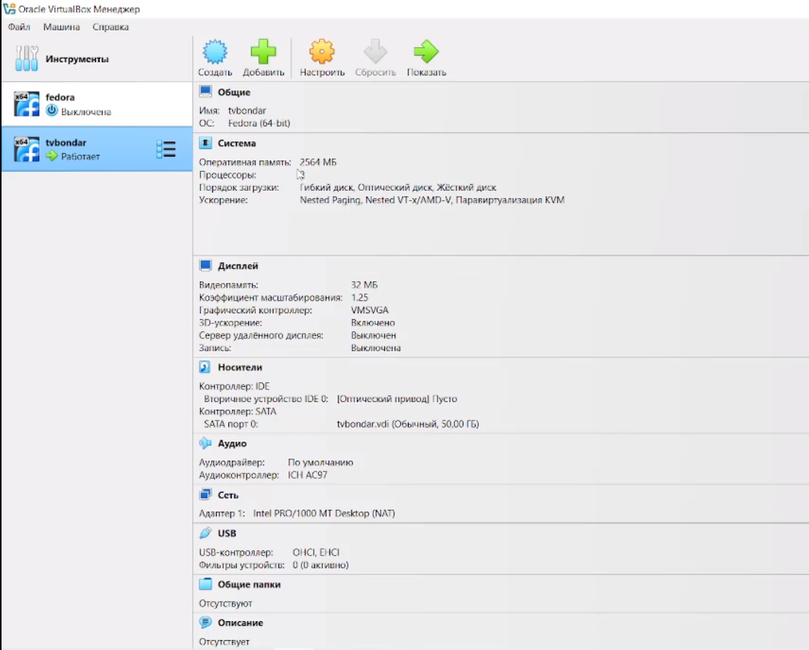{#fig:001 width=70%}

##
2. Производим установку операционной системы. 

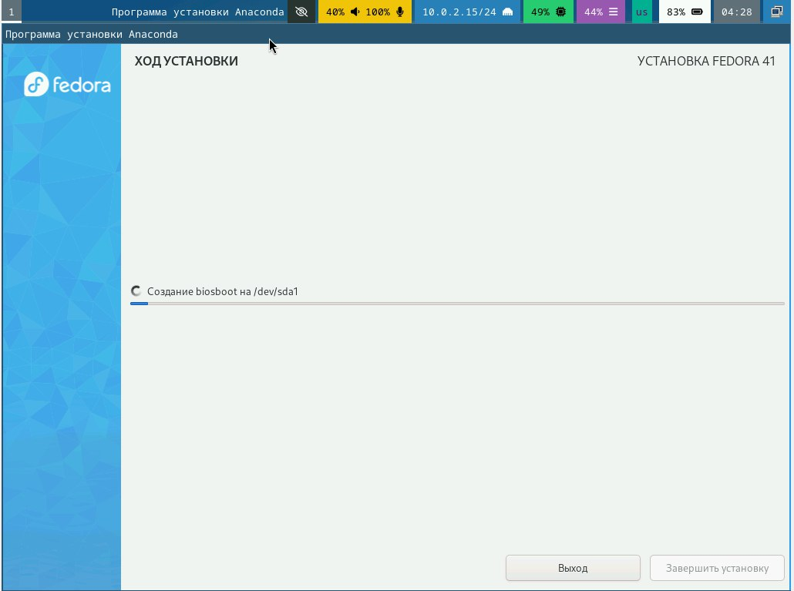{#fig:002 width=70%}

## Обновления

3. Входим в ОС под своей учетной записью. Открываем терминал. Переключаемся на роль суперпользователя. Производим установку обновлений. 

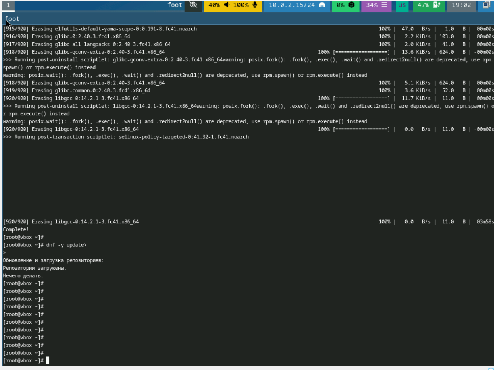{#fig:003 width=70%}

## Повышение комфорта работы. Отключение SELinux

4. Устанавливаем программу tmux. Запускаем tmux, открываем midnight commander, в файле /etc/selinux/config заменяем значение SELINUX=enforcing на SELINUX=permissive 

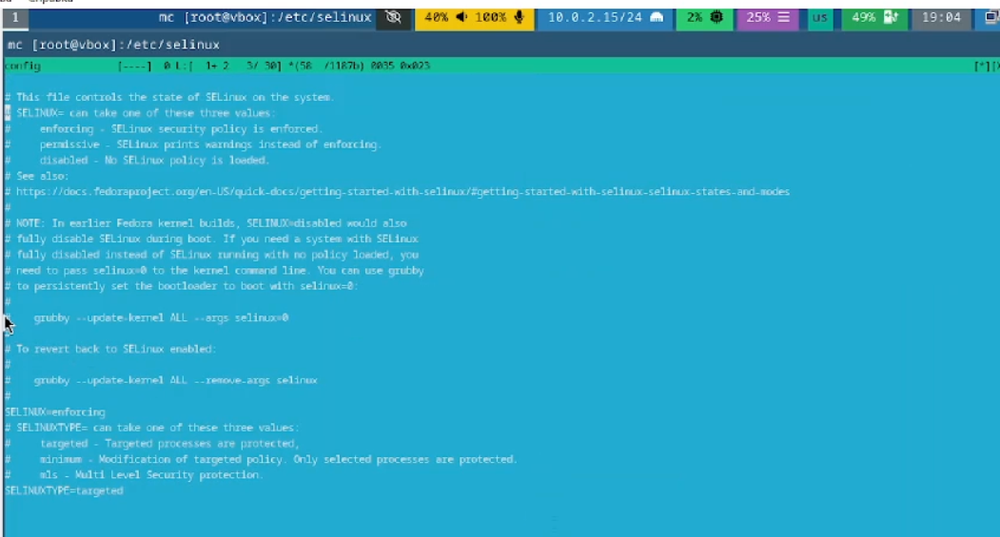{#fig:004 width=70%}

5. Перегружаем виртуальную машину.

## Настройка раскладки клавиатуры

5.  Создаем конфигурационный файл ~/.config/sway/config.d/95-system-keyboard-config.conf. 

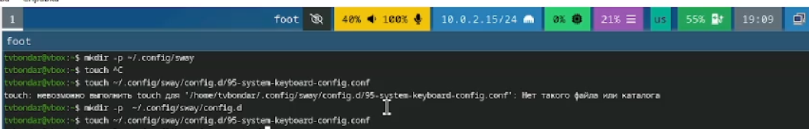{#fig:005 width=70%}

6. Отредактируем конфигурационный файл. 

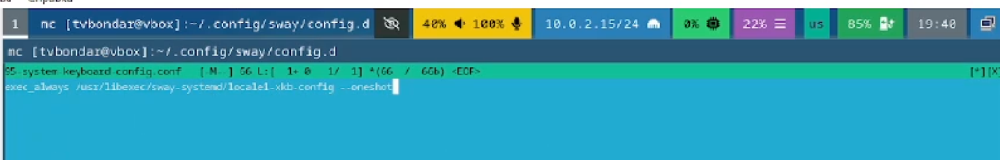{#fig:006 width=70%}

##

7. Отредактируем конфигурационный файл /etc/X11/xorg.conf.d/00-keyboard.conf. Перегрузим виртуальную машину. 

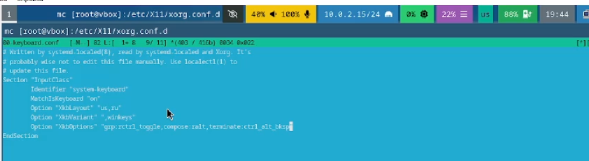{#fig:007 width=70%}

## Автоматическое обновление

8. Установим ПО для автоматического обновления 

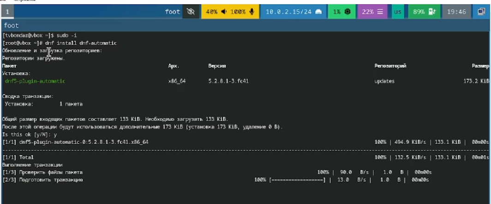{#fig:008 width=70%}

##

9. Отредактируем необходимый конфигурационный файл. Запустим таймер. 

{#fig:009 width=70%}

## Установка программного обеспечения для создания документации

10. Скачиваем pandoc и pandoc-crossref из репозиториев Github. 

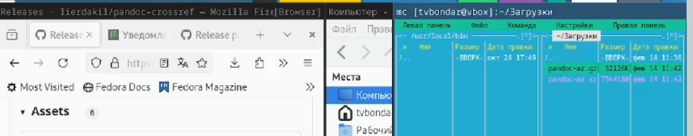{#fig:010 width=70%}

11. Переносим необходимые файлы из архивов в каталог /usr/local/bin. 

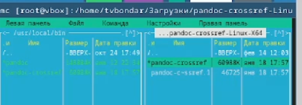{#fig:011 width=70%}

##

12. Установим дистрибутив TexLive 

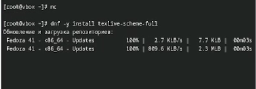{#fig:012 width=70%}

## Домашнее задание 

13. Посмотрим порядок загрузки системы с помощью команды dmesg. 

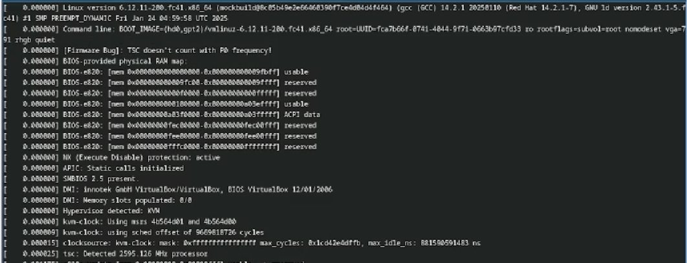{#fig:013 width=70%}

##

14. Получаем информацию о версии ядра Linux, частоте процессора, модели процессора, объеме доступной оперативной памяти, типе обнаруженного гипервизора. 

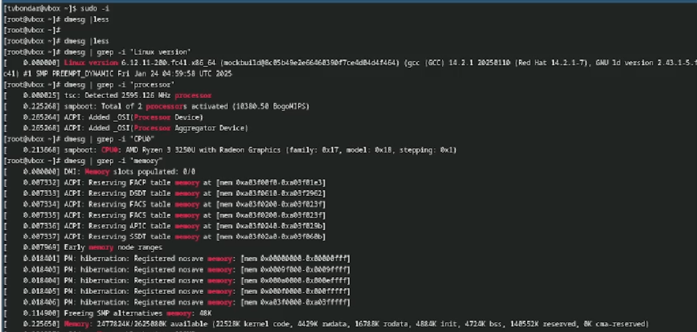{#fig:014 width=70%}

##

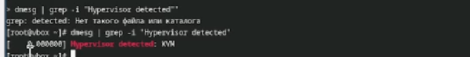{#fig:015 width=70%}

##

15. Получаем информацию о последовательности монтирования файловых систем. Тип файловой системы - Ext4. 

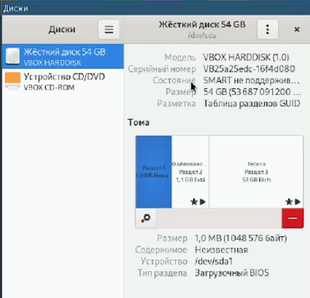{#fig:016 width=70%}

## Литература

1. Кулябов Д. С. Введерние в операционную систему UNIX - Лекция.
2. Таненбаум Э., Бос Х. Современные операционные системы. - 4-е изд. -СПб. : Питер, 2015. - 1120 с.

## Вывод

В результате выполнения лабораторной работы были приобретены навыки установки операционной системы на виртуальную машину, а также настройки минимально необходимых для дальнейшей работы сервисов.

