---
## Front matter
title: "Отчёт по лабораторной работе №1"
author: "Бондарь Татьяна Владимировна"

## Generic otions
lang: ru-RU
toc-title: "Содержание"

## Bibliography
bibliography: bib/cite.bib
csl: pandoc/csl/gost-r-7-0-5-2008-numeric.csl

## Pdf output format
toc: true # Table of contents
toc-depth: 2
lof: true # List of figures
lot: true # List of tables
fontsize: 12pt
linestretch: 1.5
papersize: a4
documentclass: scrreprt
## I18n polyglossia
polyglossia-lang:
  name: russian
  options:
	- spelling=modern
	- babelshorthands=true
polyglossia-otherlangs:
  name: english
## I18n babel
babel-lang: russian
babel-otherlangs: english
## Fonts
mainfont: PT Serif
romanfont: PT Serif
sansfont: PT Sans
monofont: PT Mono
mainfontoptions: Ligatures=TeX
romanfontoptions: Ligatures=TeX
sansfontoptions: Ligatures=TeX,Scale=MatchLowercase
monofontoptions: Scale=MatchLowercase,Scale=0.9
## Biblatex
biblatex: true
biblio-style: "gost-numeric"
biblatexoptions:
  - parentracker=true
  - backend=biber
  - hyperref=auto
  - language=auto
  - autolang=other*
  - citestyle=gost-numeric
## Pandoc-crossref LaTeX customization
figureTitle: "Рис."
tableTitle: "Таблица"
listingTitle: "Листинг"
lofTitle: "Список иллюстраций"
lotTitle: "Список таблиц"
lolTitle: "Листинги"
## Misc options
indent: true
header-includes:
  - \usepackage{indentfirst}
  - \usepackage{float} # keep figures where there are in the text
  - \floatplacement{figure}{H} # keep figures where there are in the text
---

# Цель работы

Целью данной работы является приобретение практических навыков установки операционной системы на виртуальную машину, настройки минимально необходимых для дальнейшей работы сервисов.

# Задание

1)Запуск VirtualBox и создание новой виртуальной машины (операционная система Linux, Fedora).
2)Настройка установки ОС.
3)Перезапуск виртуальной машины и установка драйверов для VirtualBox.
4)Подключение образа диска дополнений гостевой ОС.
5)Установка необходимого ПО для создания документации.
6)Выполнение домашнего задания.

# Теоретическое введение

Операционная система - это комплекс взаимосвязанных программ, который действует как интерфейс между приложениями и пользователями с одной стороны и аппаратурой компьютера с другой стороны. VirtualBox - это специальное средство для виртуализации, позволяющее запускать операционную систему внтури другой. С помощью VirtualBox мы можем также настраивать сеть, обмениваться файлами и делать многое другое.

# Выполнение лабораторной работы

## Создание виртуальной машины

1. Создаем новую виртуальную машину, указываем имя. Указываем размер основной памяти, задаем размер диска. Добавляем новый привод оптических дисков и выбираем образ операционной системы Fedora. (рис. @fig:001).

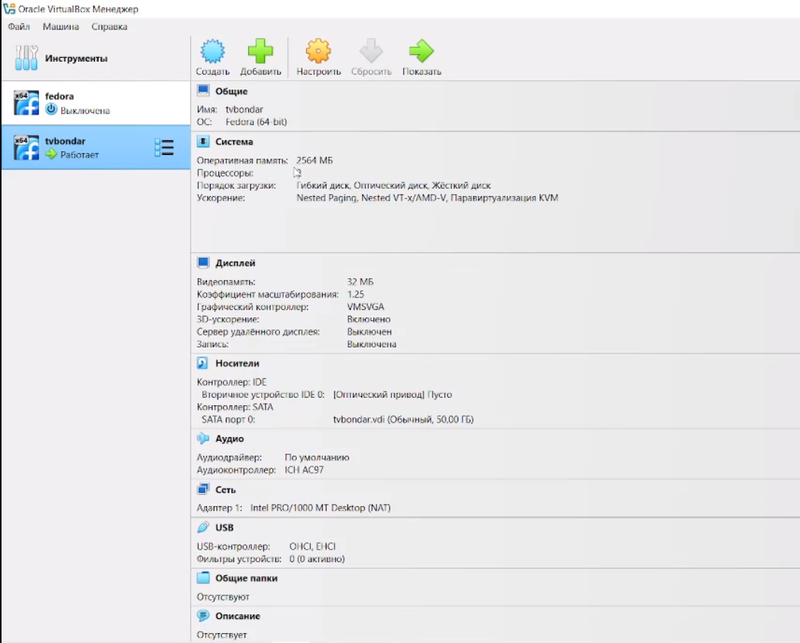{#fig:001 width=70%}

2. Производим установку операционной системы. (рис. @fig:002).

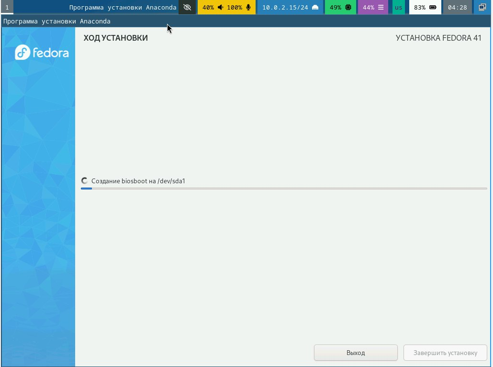{#fig:002 width=70%}

## После установки

### Обновления

3. Входим в ОС под своей учетной записью. Открываем терминал. Переключаемся на роль суперпользователя. Производим установку обновлений. (рис. @fig:003).

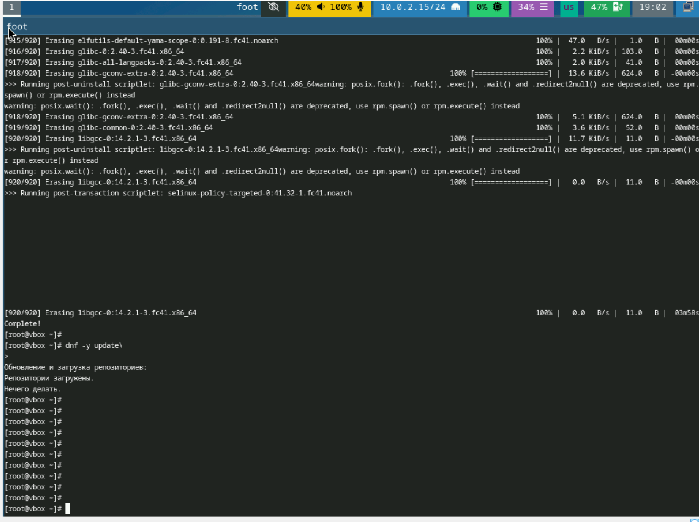{#fig:003 width=70%}

### Повышение комфорта работы. Отключение SELinux

4. Устанавливаем программу tmux. (рис. @fig:004). Запускаем tmux, открываем midnight commander, в файле /etc/selinux/config заменяем значение SELINUX=enforcing на SELINUX=permissive (рис. @fig:004).

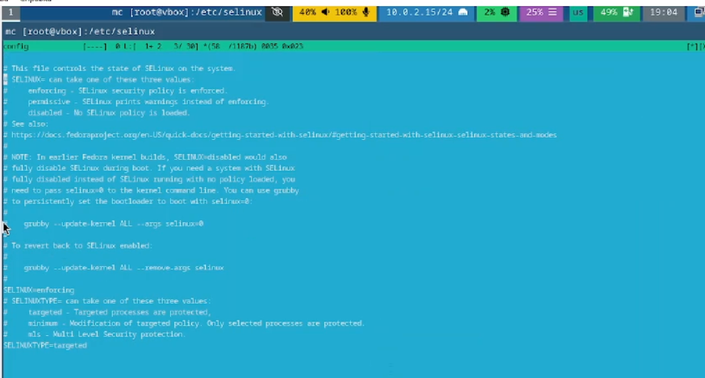{#fig:004 width=70%}

5. Перегружаем виртуальную машину.

## Настройка раскладки клавиатуры
5.  Создаем конфигурационный файл ~/.config/sway/config.d/95-system-keyboard-config.conf. (рис. @fig:005).

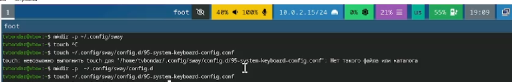{#fig:005 width=70%}

6. Отредактируем конфигурационный файл. (рис. @fig:006).

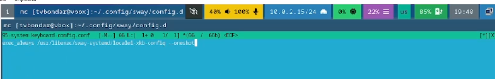{#fig:006 width=70%}

7. Отредактируем конфигурационный файл /etc/X11/xorg.conf.d/00-keyboard.conf. Перегрузим виртуальную машину. (рис. @fig:007). 

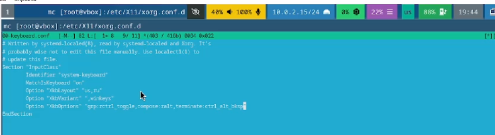{#fig:007 width=70%}

### Автоматическое обновление

8. Установим ПО для автоматического обновления (рис. @fig:008).

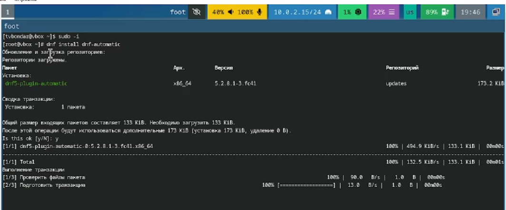{#fig:008 width=70%}

9. Отредактируем необходимый конфигурационный файл. Запустим таймер. (рис. @fig:009).

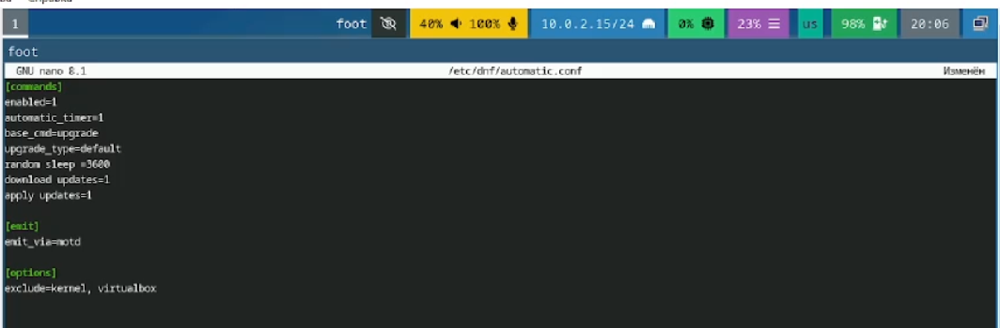{#fig:009 width=70%}

## Установка программного обеспечения для создания документации

10. Скачиваем pandoc и pandoc-crossref из репозиториев Github. (рис. @fig:010).

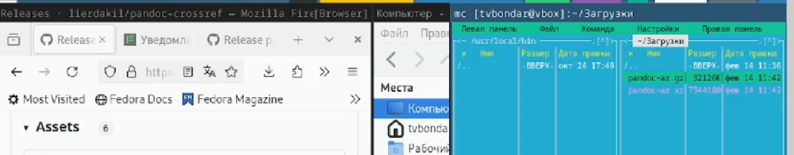{#fig:010 width=70%}

11. Переносим необходимые файлы из архивов в каталог /usr/local/bin. (рис. @fig:011).

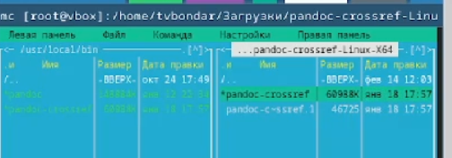{#fig:011 width=70%}

12. Установим дистрибутив TexLive (рис. @fig:012).

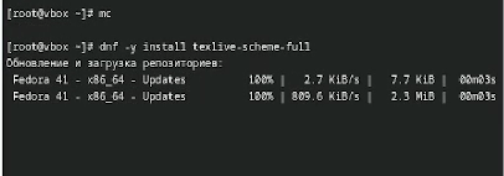{#fig:012 width=70%}

## Домашнее задание 
13. Посмотрим порядок загрузки системы с помощью команды dmesg. (рис. @fig:013).

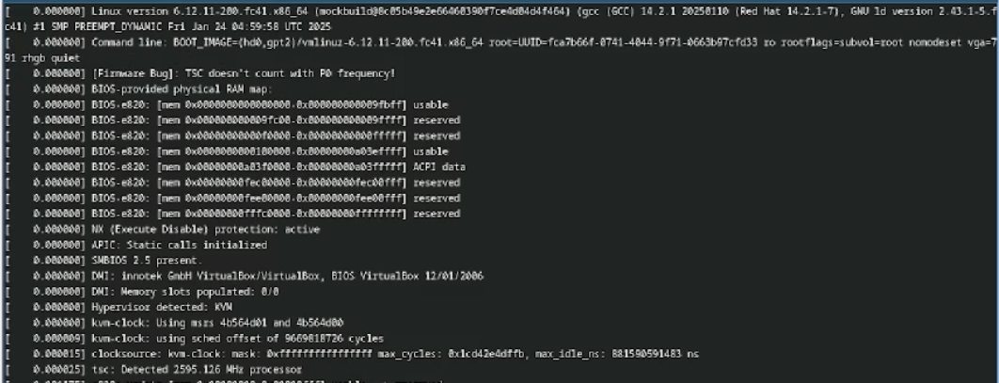{#fig:013 width=70%}

14. Получаем информацию о версии ядра Linux, частоте процессора, модели процессора, объеме доступной оперативной памяти, типе обнаруженного гипервизора. (рис. @fig:014). (рис. @fig:015)

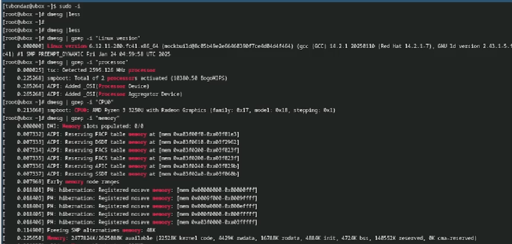{#fig:014 width=70%}

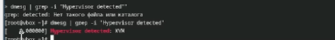{#fig:015 width=70%}

15. Получаем информацию о последовательности монтирования файловых систем. Тип файловой системы - Ext4.  (рис. @fig:016).

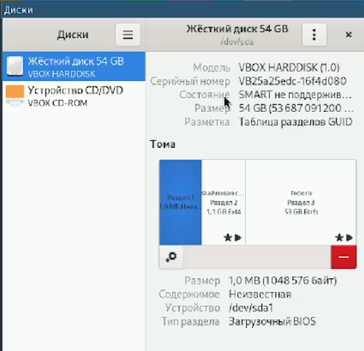{#fig:016 width=70%}

# Контрольные вопросы

1) Какую информацию содержит учетная запись пользователя?

Имя пользователя, зашифрованный пароль пользователя, индентификационный номер пользователя, индентификационный номер группы пользователя, домашний каталог пользователя, командный интерпретатор пользователя.

2) Укажите команды терминала и приведите примеры: 
-для получения справки по команде: man <назввание команды> man cd
-ддя перемещения по файловой системе: cd cd ~/Downloads
-для просмотра содержимого каталога: ls ls ~/Downloads
-для определения объема каталога: du <имя каталога> du Downloads
-для создания каталогов: mkdir <имя каталога> mkdir ~/Downloads/New
-для создания файлов: touch <имя файла> touch retouch
-для удаления каталогов: rm <имя каталога> rm dir1
-для удаления файлов: rm -r <имя файла> rm -r text.txt
-для задания определенных прав на файл или каталог: chmod + x <имя каталога или файла> chmod +x text.txt
-для просмотра истории команд: history

3) Что такое файловая система? Приведите примеры с краткой характеристикой.

Файловая система - это часть операционной системы, назначение которой состоит в том, чтобы обеспечить пользователю удобный интерфейс при работе с данными, хранящимися на диске, и обеспечить совместное использование файлов несколькими пользователями и процессорами.
Примеры файловых систем: 
Ext2, Ext3, Ext4 или Extended Felisystem - стандартная файловая система для Linux.
NTFS (New Technology File System):  Стандартная файловая система для Windows.

4) Как посмотреть, какие файловые системы подмонтированы в ОС?

С помощью команды mount

5) Как удалить зависший процесс?

С помощью команды kill.

# Выводы

В результате выполнения лабораторной работы мы приобрели навыки установки операционной системы на виртуальную машину, а также настройки минимально необходимых для дальнейшей работы сервисов.

# Список литературы{.unnumbered}

1) Кулябов Д. С. Введерние в операционную систему UNIX - Лекция.
2) Таненбаум Э., Бос Х. Современные операционные системы. - 4-е изд. -СПб. : Питер, 2015. - 1120 с.

::: {#refs}
:::
