---
## Front matter
lang: ru-RU
title: Лабораторная работа № 4
subtitle: 
author:
  - Бондарь Т. В.
institute:
  - Российский университет дружбы народов, Москва, Россия

## i18n babel
babel-lang: russian
babel-otherlangs: english

## Formatting pdf
toc: false
toc-title: Содержание
slide_level: 2
aspectratio: 169
section-titles: true
theme: metropolis
header-includes:
 - \metroset{progressbar=frametitle,sectionpage=progressbar,numbering=fraction}
---

# Информация

## Докладчик

:::::::::::::: {.columns align=center}
::: {.column width="70%"}

  * Бондарь Татьяна Владимировна
  * НКАбд-01-24, студ. билет №1132246711
  * Российский университет дружбы народов
  * <https://github.com/tvbondar/study_2024-2025_os-intro>

:::
::: {.column width="30%"}

:::
::::::::::::::

## Цель работы

Получение навыков правильной работы с репозиториями git.

## Задание

1. Выполнить работу для тестового репозитория.
2. Преобразовать рабочий репозиторий в репозиторий с git-flow и conventional commits.

## Теоретическое введение

Gitflow Workflow опубликована и популяризована Винсентом Дриссеном. Gitflow Workflow предполагает выстраивание строгой модели ветвления с учётом выпуска проекта. Данная модель отлично подходит для организации рабочего процесса на основе релизов.v Работа по модели Gitflow включает создание отдельной ветки для исправлений ошибок в рабочей среде. 

Семантическое версионирование описывается в манифесте семантического версионирования. Кратко его можно описать следующим образом: Версия задаётся в виде кортежа МАЖОРНАЯ_ВЕРСИЯ.МИНОРНАЯ_ВЕРСИЯ.ПАТЧ. Номер версии следует увеличивать: МАЖОРНУЮ версию, когда сделаны обратно несовместимые изменения API. МИНОРНУЮ версию, когда вы добавляете новую функциональность, не нарушая обратной совместимости. ПАТЧ-версию, когда вы делаете обратно совместимые исправления. Дополнительные обозначения для предрелизных и билд-метаданных возможны как дополнения к МАЖОРНАЯ.МИНОРНАЯ.ПАТЧ формату.

Спецификация Conventional Commits: Соглашение о том, как нужно писать сообщения commit'ов. Совместимо с SemVer. Даже вернее сказать, сильно связано с семантическим версионированием. Регламентирует структуру и основные типы коммитов.

## Выполнение лабораторной работы. Установка ПО. Устнановка git-flow.  
1. Устанавливаем git-flow 

{#fig:001 width=70%}

## Node.js

2. Устанавливаем Node.js 

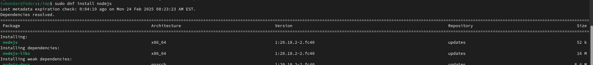{#fig:002 width=70%}

##

{#fig:003 width=70%}

## Настройка Node.js.

3. Для работы с Node.js добавим каталог с исполняемыми файлами, устанавливаемыми yarn, в переменную PATH. 

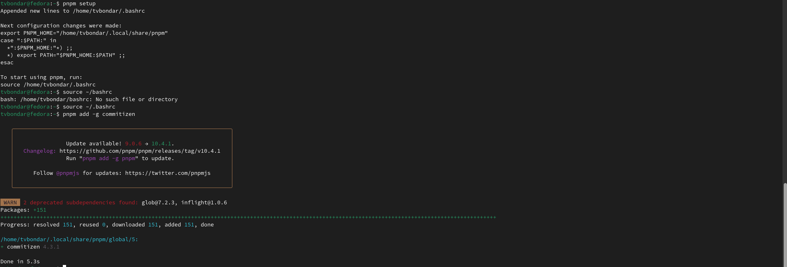{#fig:004 width=70%}

## Общепринятые коммиты

4. Настраиваем commitizen, standard-changelog. 

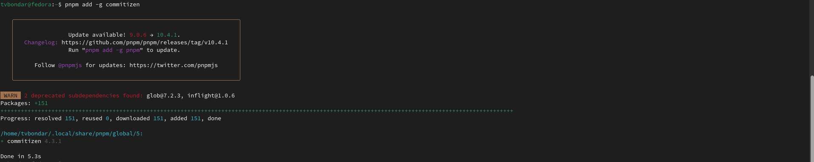{#fig:005 width=70%}

##

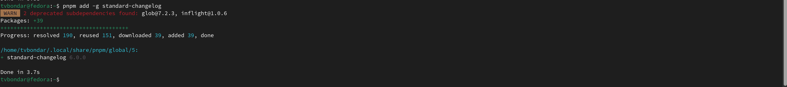{#fig:006 width=70%}

## Практический сценарий использования git.  Создание репозитория. Работа с репозиторием. 

5. Создаем репозиторий на GitHub. Для примера назовём его git-extended. Делаем первый коммит и выкладываем на github: 

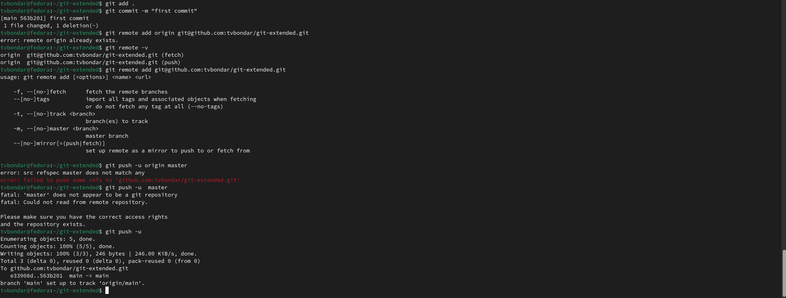{#fig:007 width=70%}

##

6. Конфигурация общепринятых коммитов. Для этого добавим в файл package.json команду для формирования коммитов: 

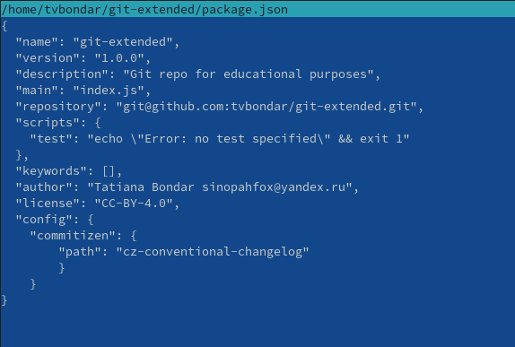{#fig:008 width=70%}

##

7. Добавляем файлы, выполняем коммит, отправляем на Github. 

{#fig:009 width=70%} 

##

8. Инициализируем git-flow Префикс для ярлыков установим в v. Проверьте, что Вы на ветке develop: Загрузите весь репозиторий в хранилище: Установите внешнюю ветку как вышестоящую для этой ветки: Создадим релиз с версией 1.0.0 

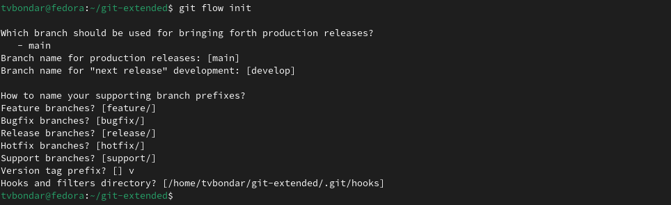{#fig:010 width=70%} 

##

{#fig:011 width=70%} 

##

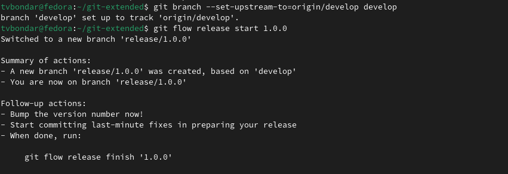{#fig:012 width=70%} 

##

9. Создадим журнал изменений Добавим журнал изменений в индекс Зальём релизную ветку в основную ветку Отправим данные на github Создадим релиз на github. Для этого будем использовать утилиты работы с github: 

{#fig:013 width=70%} 

##

{#fig:014 width=70%} 

##

{#fig:015 width=70%} 

##

{#fig:016 width=70%} 

##

10. Создадим ветку для новой функциональности.  Следующим шагом следует объединить ветку feature_branch c develop. 

{#fig:017 width=70%} 

##

11. Создадим релиз с версией 1.2.3. Обновим номер версии в файле package.json. Установим её в 1.2.3.  

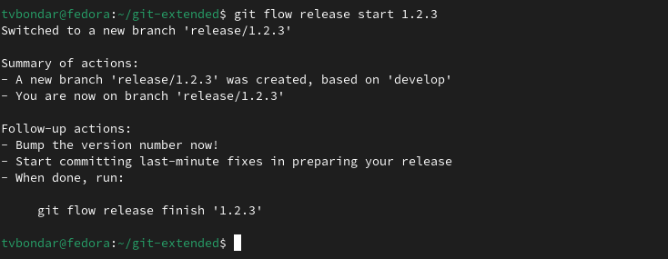{#fig:018 width=70%} 

##

{#fig:019 width=70%} 

##

12. Создадим журнал изменений Добавим журнал изменений в индекс Зальём релизную ветку в основную ветку Отправим данные на github Создадим релиз на github с комментарием из журнала изменений: 

{#fig:020 width=70%} 

##

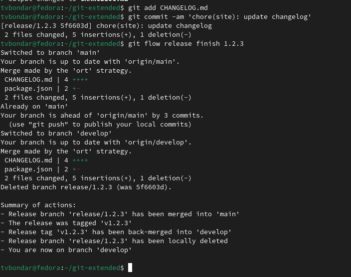{#fig:021 width=70%} 

##

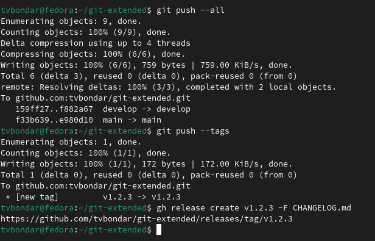{#fig:022 width=70%} 

## Выводы

Мы получили навыки правильной работы с репозиториями git.

# Список литературы{.unnumbered}

Рабочий процесс с Gitflow(электронный ресурс) URL: https://yamadharma.github.io/ru/post/2021/04/18/gitflow-workflow/

::: {#refs}
:::

