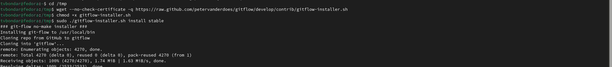
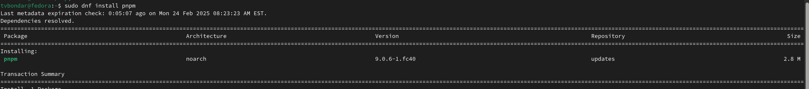
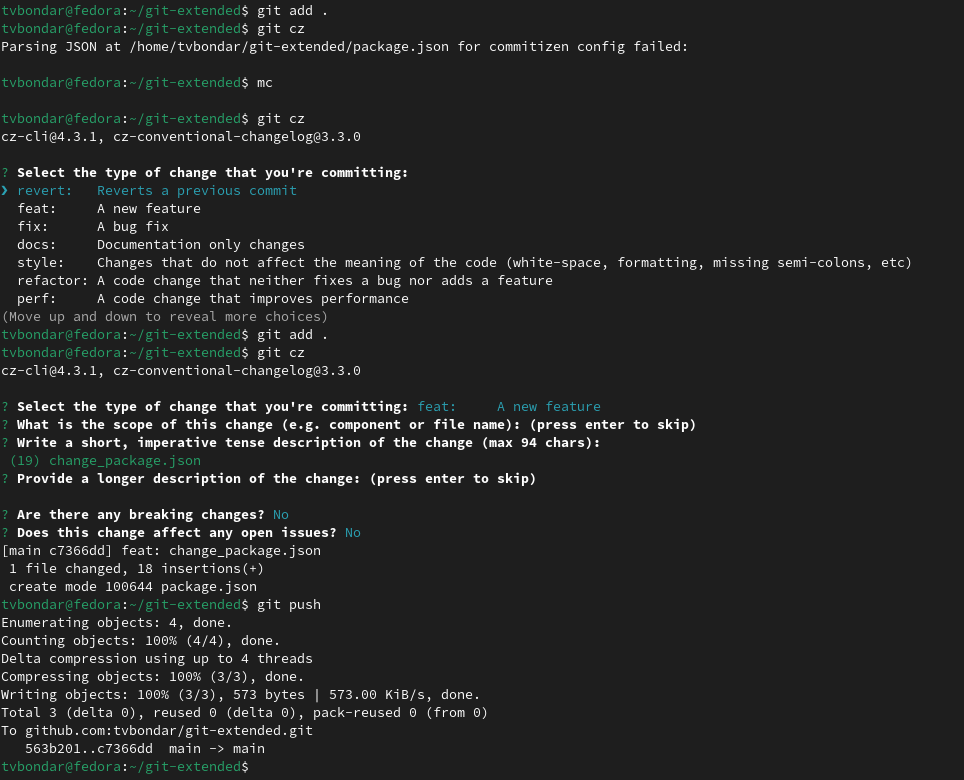
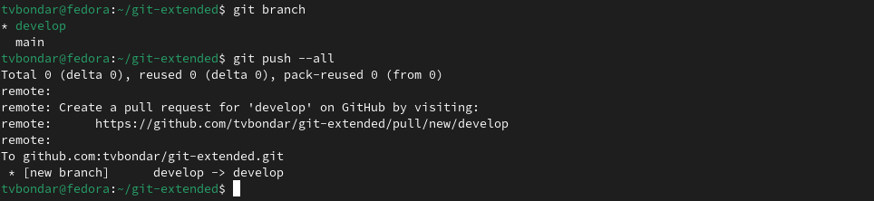
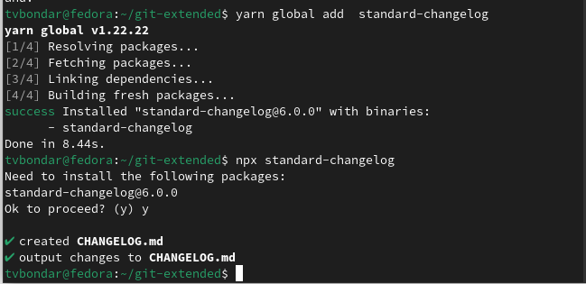
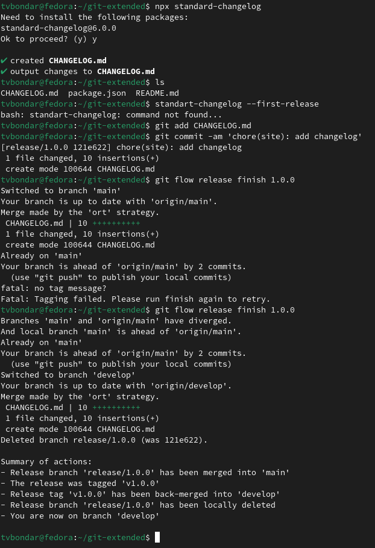
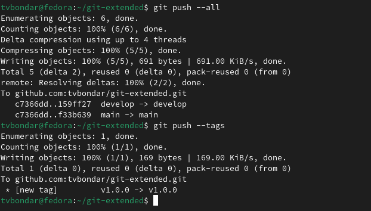
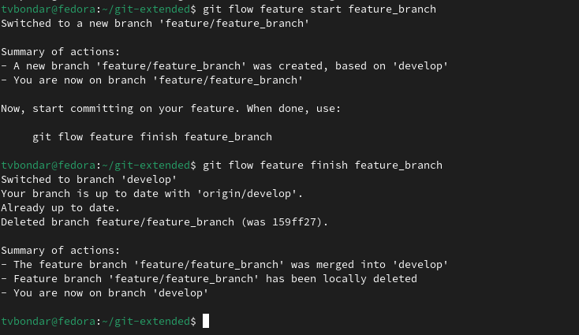
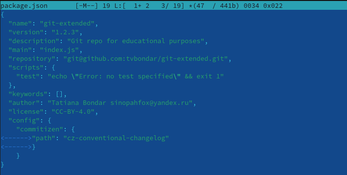

---
## Front matter
title: "Отчет по лабораторной работе № 4"
subtitle:
author: "Бондарь Татьяна Владимировна"

## Generic otions
lang: ru-RU
toc-title: "Содержание"

## Bibliography
bibliography: bib/cite.bib
csl: pandoc/csl/gost-r-7-0-5-2008-numeric.csl

## Pdf output format
toc: true # Table of contents
toc-depth: 2
lof: true # List of figures
lot: true # List of tables
fontsize: 12pt
linestretch: 1.5
papersize: a4
documentclass: scrreprt
## I18n polyglossia
polyglossia-lang:
  name: russian
  options:
	- spelling=modern
	- babelshorthands=true
polyglossia-otherlangs:
  name: english
## I18n babel
babel-lang: russian
babel-otherlangs: english
## Fonts
mainfont: IBM Plex Serif
romanfont: IBM Plex Serif
sansfont: IBM Plex Sans
monofont: IBM Plex Mono
mathfont: STIX Two Math
mainfontoptions: Ligatures=Common,Ligatures=TeX,Scale=0.94
romanfontoptions: Ligatures=Common,Ligatures=TeX,Scale=0.94
sansfontoptions: Ligatures=Common,Ligatures=TeX,Scale=MatchLowercase,Scale=0.94
monofontoptions: Scale=MatchLowercase,Scale=0.94,FakeStretch=0.9
mathfontoptions:
## Biblatex
biblatex: true
biblio-style: "gost-numeric"
biblatexoptions:
  - parentracker=true
  - backend=biber
  - hyperref=auto
  - language=auto
  - autolang=other*
  - citestyle=gost-numeric
## Pandoc-crossref LaTeX customization
figureTitle: "Рис."
tableTitle: "Таблица"
listingTitle: "Листинг"
lofTitle: "Список иллюстраций"
lotTitle: "Список таблиц"
lolTitle: "Листинги"
## Misc options
indent: true
header-includes:
  - \usepackage{indentfirst}
  - \usepackage{float} # keep figures where there are in the text
  - \floatplacement{figure}{H} # keep figures where there are in the text
---

# Цель работы

Получение навыков правильной работы с репозиториями git.

# Задание

1. Выполнить работу для тестового репозитория.
2. Преобразовать рабочий репозиторий в репозиторий с git-flow и conventional commits.

# Теоретическое введение

Gitflow Workflow опубликована и популяризована Винсентом Дриссеном. Gitflow Workflow предполагает выстраивание строгой модели ветвления с учётом выпуска проекта. Данная модель отлично подходит для организации рабочего процесса на основе релизов.v Работа по модели Gitflow включает создание отдельной ветки для исправлений ошибок в рабочей среде. 

Семантическое версионирование описывается в манифесте семантического версионирования. Кратко его можно описать следующим образом: Версия задаётся в виде кортежа МАЖОРНАЯ_ВЕРСИЯ.МИНОРНАЯ_ВЕРСИЯ.ПАТЧ. Номер версии следует увеличивать: МАЖОРНУЮ версию, когда сделаны обратно несовместимые изменения API. МИНОРНУЮ версию, когда вы добавляете новую функциональность, не нарушая обратной совместимости. ПАТЧ-версию, когда вы делаете обратно совместимые исправления. Дополнительные обозначения для предрелизных и билд-метаданных возможны как дополнения к МАЖОРНАЯ.МИНОРНАЯ.ПАТЧ формату.

Спецификация Conventional Commits: Соглашение о том, как нужно писать сообщения commit'ов. Совместимо с SemVer. Даже вернее сказать, сильно связано с семантическим версионированием. Регламентирует структуру и основные типы коммитов.

# Выполнение лабораторной работы

## Установка ПО. Устнановка git-flow, Node.js. Настройка Node.js. Общепринятые коммиты

1. Устанавливаем git-flow (рис. @fig:001).

{#fig:001 width=70%}

2. Устанавливаем Node.js (рис. @fig:002). (рис. @fig:003).

{#fig:002 width=70%}

{#fig:003 width=70%}

3. Для работы с Node.js добавим каталог с исполняемыми файлами, устанавливаемыми yarn, в переменную PATH. (рис. @fig:004).

{#fig:004 width=70%}

4. Настраиваем commitizen, standard-changelog. (рис. @fig:005). (рис. @fig:006).

{#fig:005 width=70%}

{#fig:006 width=70%}

## Практический сценарий использования git.  Создание репозитория. Работа с репозиторием. 

 5. Создаем репозиторий на GitHub. Для примера назовём его git-extended. Делаем первый коммит и выкладываем на github: (рис. @fig:007).

{#fig:007 width=70%}

6. Конфигурация общепринятых коммитов. Для этого добавим в файл package.json команду для формирования коммитов: (рис. @fig:008). 

{#fig:008 width=70%}

7. Добавляем файлы, выполняем коммит, отправляем на Github. (рис. @fig:009).

{#fig:009 width=70%} 

8. Инициализируем git-flow Префикс для ярлыков установим в v. Проверьте, что Вы на ветке develop: Загрузите весь репозиторий в хранилище: Установите внешнюю ветку как вышестоящую для этой ветки: Создадим релиз с версией 1.0.0 (рис. @fig:010). (рис. @fig:011). (рис. @fig:012).

{#fig:010 width=70%} 

{#fig:011 width=70%} 

{#fig:012 width=70%} 

9. Создадим журнал изменений Добавим журнал изменений в индекс Зальём релизную ветку в основную ветку Отправим данные на github Создадим релиз на github. Для этого будем использовать утилиты работы с github: (рис. @fig:013). (рис. @fig:014). (рис. @fig:015). (рис. @fig:016).

{#fig:013 width=70%} 

{#fig:014 width=70%} 

{#fig:015 width=70%} 

{#fig:016 width=70%} 

10. Создадим ветку для новой функциональности.  Следующим шагом следует объединить ветку feature_branch c develop. (рис. @fig:017).

{#fig:017 width=70%} 

11. Создадим релиз с версией 1.2.3. Обновим номер версии в файле package.json. Установим её в 1.2.3.  (рис. @fig:018).  (рис. @fig:019).

{#fig:018 width=70%} 

{#fig:019 width=70%} 

12. Создадим журнал изменений Добавим журнал изменений в индекс Зальём релизную ветку в основную ветку Отправим данные на github Создадим релиз на github с комментарием из журнала изменений: (рис. @fig:020). (рис. @fig:021). (рис. @fig:022).

{#fig:020 width=70%} 

{#fig:021 width=70%} 

{#fig:022 width=70%} 

# Выводы

Мы получили навыки правильной работы с репозиториями git.

# Список литературы{.unnumbered}

Рабочий процесс с Gitflow(электронный ресурс) URL: https://yamadharma.github.io/ru/post/2021/04/18/gitflow-workflow/

::: {#refs}
:::
