---
## Front matter
lang: ru-RU
title: Лабораторная работа № 7
subtitle: Архитектура компьютера, раздел Операционные системы
author:
  - Бондарь Т. В.
institute:
  - Российский университет дружбы народов, Москва, Россия

## i18n babel
babel-lang: russian
babel-otherlangs: english

## Formatting pdf
toc: false
toc-title: Содержание
slide_level: 2
aspectratio: 169
section-titles: true
theme: metropolis
header-includes:
 - \metroset{progressbar=frametitle,sectionpage=progressbar,numbering=fraction}
---

# Информация

## Докладчик

:::::::::::::: {.columns align=center}
::: {.column width="70%"}

  * Бондарь Татьяна Владимировна
  * НКАбд-01-24, студ. билет №1132246711
  * Российский университет дружбы народов
  * <https://github.com/tvbondar/study_2024-2025_os-intro>

:::
::: {.column width="30%"}

:::
::::::::::::::

## Цель работы

Ознакомление с файловой системой Linux, её структурой, именами и содержанием
каталогов. Приобретение практических навыков по применению команд для работы
с файлами и каталогами, по управлению процессами (и работами), по проверке исполь-
зования диска и обслуживанию файловой системы.

## Задание

1. Выполните все примеры, приведённые в первой части описания лабораторной работы.
2. Выполните следующие действия, зафиксировав в отчёте по лабораторной работе
используемые при этом команды и результаты их выполнения:
2.1. Скопируйте файл /usr/include/sys/io.h в домашний каталог и назовите его
equipment. Если файла io.h нет, то используйте любой другой файл в каталоге
/usr/include/sys/ вместо него.
2.2. В домашнем каталоге создайте директорию ~/ski.plases.
2.3. Переместите файл equipment в каталог ~/ski.plases.
2.4. Переименуйте файл ~/ski.plases/equipment в ~/ski.plases/equiplist.
2.5. Создайте в домашнем каталоге файл abc1 и скопируйте его в каталог
~/ski.plases, назовите его equiplist2.
2.6. Создайте каталог с именем equipment в каталоге ~/ski.plases.
2.7. Переместите файлы ~/ski.plases/equiplist и equiplist2 в каталог
~/ski.plases/equipment.
2.8. Создайте и переместите каталог ~/newdir в каталог ~/ski.plases и назовите
его plans.

##

3. Определите опции команды chmod, необходимые для того, чтобы присвоить перечис-
ленным ниже файлам выделенные права доступа, считая, что в начале таких прав
нет:
3.1. drwxr--r-- ... australia
3.2. drwx--x--x ... play
3.3. -r-xr--r-- ... my_os
3.4. -rw-rw-r-- ... feathers
При необходимости создайте нужные файлы.
4. Проделайте приведённые ниже упражнения, записывая в отчёт по лабораторной
работе используемые при этом команды:
4.1. Просмотрите содержимое файла /etc/password.
4.2. Скопируйте файл ~/feathers в файл ~/file.old.
4.3. Переместите файл ~/file.old в каталог ~/play.
4.4. Скопируйте каталог ~/play в каталог ~/fun.
4.5. Переместите каталог ~/fun в каталог ~/play и назовите его games.

##

4.6. Лишите владельца файла ~/feathers права на чтение.
4.7. Что произойдёт, если вы попытаетесь просмотреть файл ~/feathers командой
cat?
4.8. Что произойдёт, если вы попытаетесь скопировать файл ~/feathers?
4.9. Дайте владельцу файла ~/feathers право на чтение.
4.10. Лишите владельца каталога ~/play права на выполнение.
4.11. Перейдите в каталог ~/play. Что произошло?
4.12. Дайте владельцу каталога ~/play право на выполнение.
5. Прочитайте man по командам mount, fsck, mkfs, kill и кратко их охарактеризуйте,
приведя примеры.

##

3.5. Удалите каталог ~/newdir/morefun из домашнего каталога. Проверьте, был ли
каталог удалён.
4. С помощью команды man определите, какую опцию команды ls нужно использо-
вать для просмотра содержимое не только указанного каталога, но и подкаталогов,
входящих в него.
5. С помощью команды man определите набор опций команды ls, позволяющий отсорти-
ровать по времени последнего изменения выводимый список содержимого каталога
с развёрнутым описанием файлов.
6. Используйте команду man для просмотра описания следующих команд: cd, pwd, mkdir,
rmdir, rm. Поясните основные опции этих команд.
7. Используя информацию, полученную при помощи команды history, выполните мо-
дификацию и исполнение нескольких команд из буфера команд.

## Теоретическое введение

Файловая система в Linux состоит из фалов и каталогов. Каждому физическому носи-
телю соответствует своя файловая система.
Существует несколько типов файловых систем. Перечислим наиболее часто встречаю-
щиеся типы:
– ext2fs (second extended filesystem);
– ext2fs (third extended file system);
– ext4 (fourth extended file system);
– ReiserFS;
– xfs;
– fat (file allocation table);
– ntfs (new technology file system).
Для просмотра используемых в операционной системе файловых систем можно вос-
пользоваться командой mount без параметров.

## Выполнение лабораторной работы. 

1. Выполним все примеры, приведённые в первой части описания лабораторной работы. 

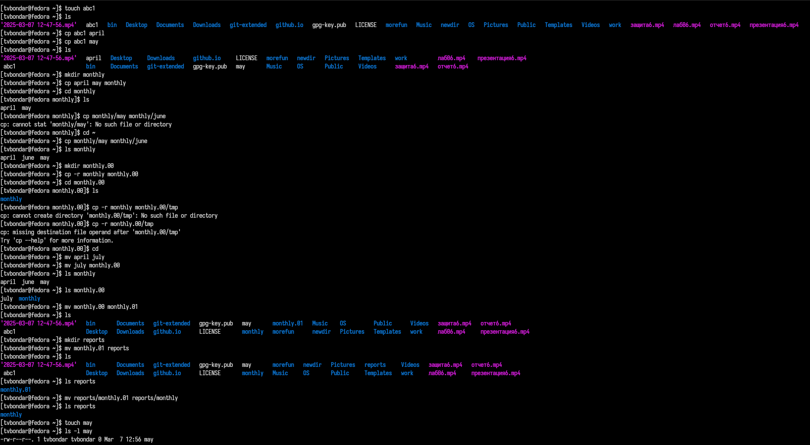{#fig:001 width=70%}

##

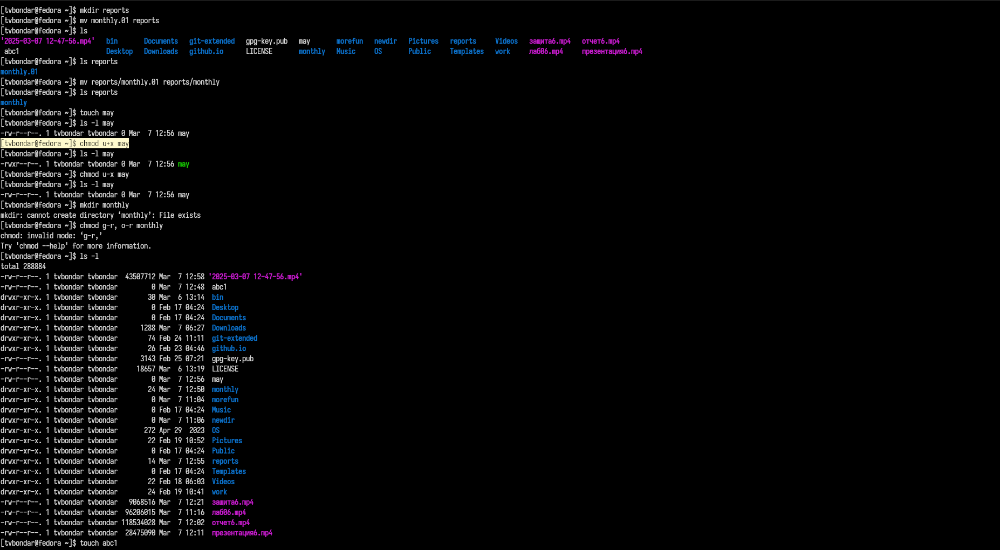{#fig:002 width=70%}

##

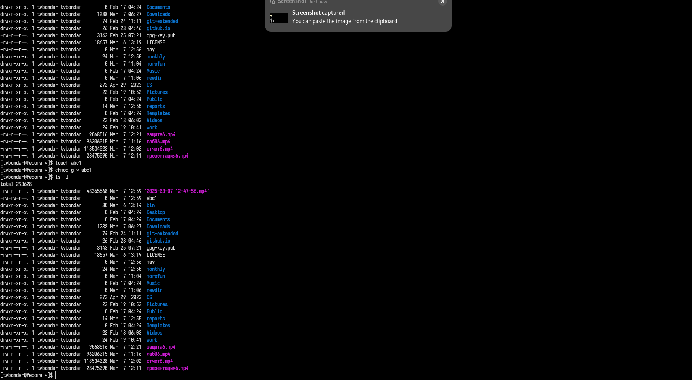{#fig:003 width=70%}

##

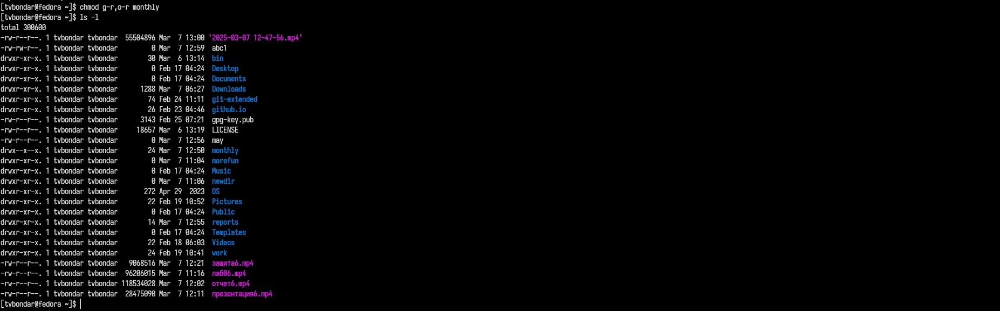{#fig:004 width=70%}

##

2. Скопируем файл /usr/include/sys/io.h в домашний каталог и назовем его
equipment.  В домашнем каталоге создадим директорию ~/ski.plases. Переместим файл equipment в каталог ~/ski.plases. Переименуем файл ~/ski.plases/equipment в ~/ski.plases/equiplist. Создадим в домашнем каталоге файл abc1 и скопируем его в каталог ~/ski.plases, назовем его equiplist2. Создадим каталог с именем equipment в каталоге ~/ski.plases. Переместим файлы ~/ski.plases/equiplist и equiplist2 в каталог ~/ski.plases/equipment.  Создадим и переместим каталог ~/newdir в каталог ~/ski.plases и назовем
его plans.   

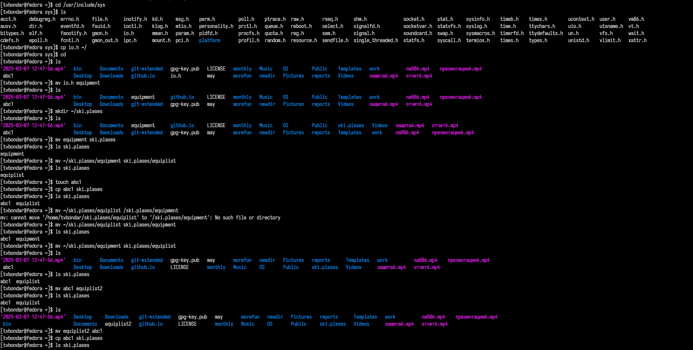{#fig:005 width=70%}

##

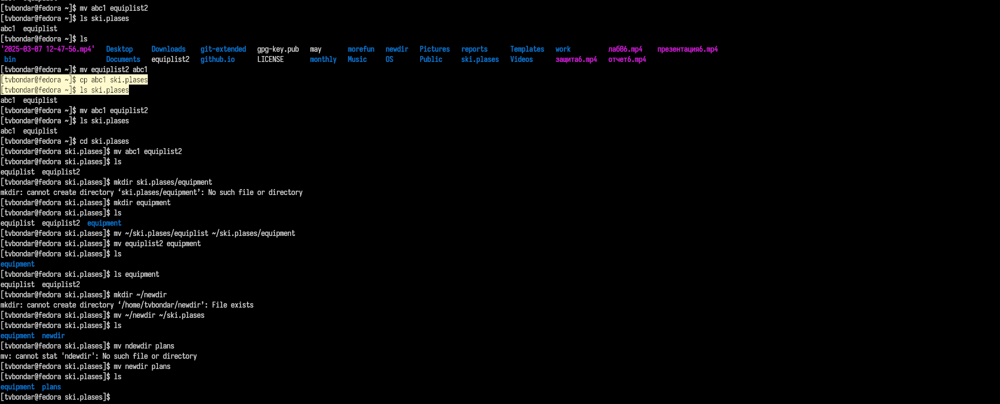{#fig:006 width=70%} 

##

3. Изменим права доступа ряду файлов 

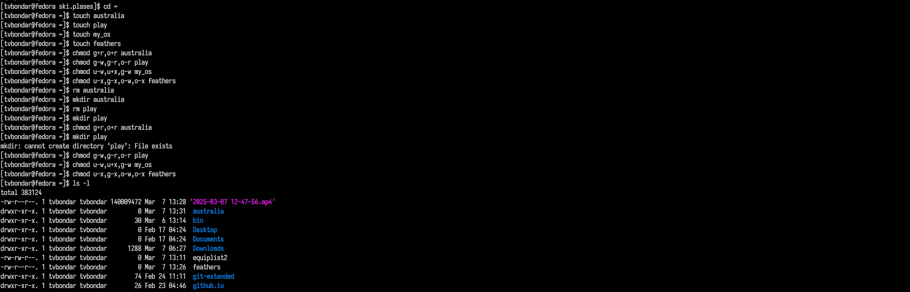{#fig:007 width=70%}  

##

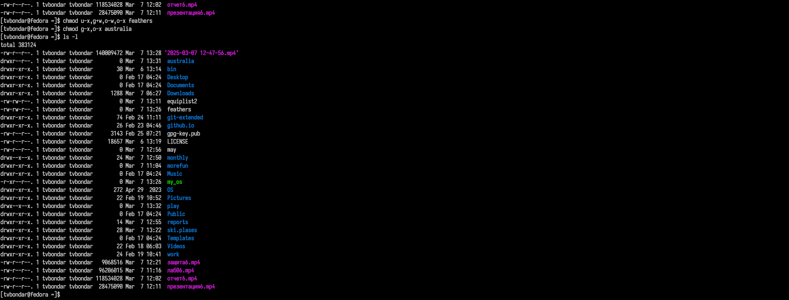{#fig:008 width=70%} 

##

4.   Просмотрим содержимое файла /etc/password.

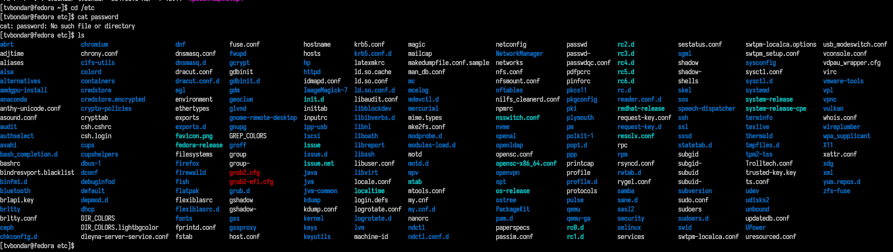{#fig:009 width=70%} 

##

5.  Скопируем файл ~/feathers в файл ~/file.old. Переместим файл ~/file.old в каталог ~/play. Скопируем каталог ~/play в каталог ~/fun. Переместим каталог ~/fun в каталог ~/play и назовем его games. Лишим владельца файла ~/feathers права на чтение. Что произойдёт, если вы попытаетесь просмотреть файл ~/feathers командойcat? Отказано в доступе. Что произойдёт, если вы попытаетесь скопировать файл ~/feathers? ОТказано в доствупе. Дадим владельцу файла ~/feathers право на чтение. Лишим владельца каталога ~/play права на выполнение. Перейдем в каталог ~/play. Дадим владельцу каталога ~/play право на выполнение.

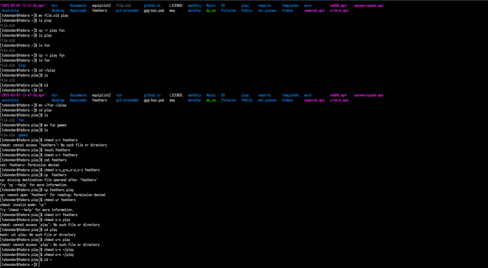{#fig:010 width=70%} 

##

6. Прочитаем man по командам mount, fsck, mkfs, kill 

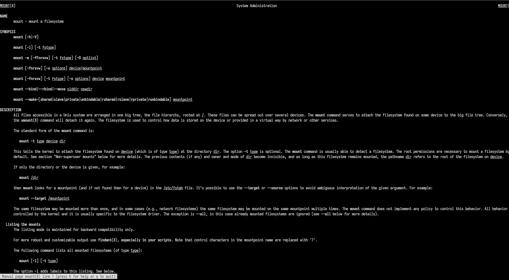{#fig:011 width=70%} 

##

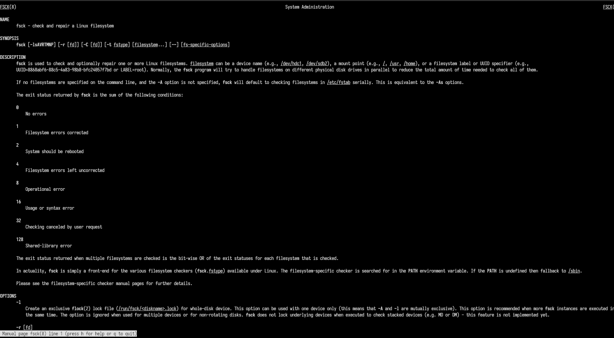{#fig:012 width=70%} 

##

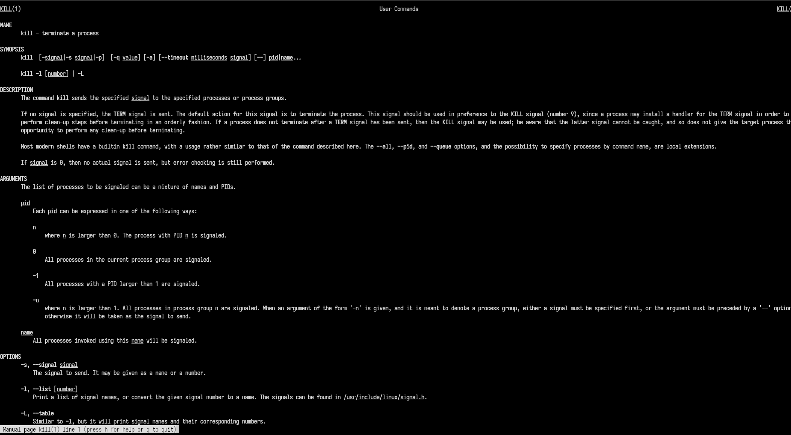{#fig:013 width=70%} 

##

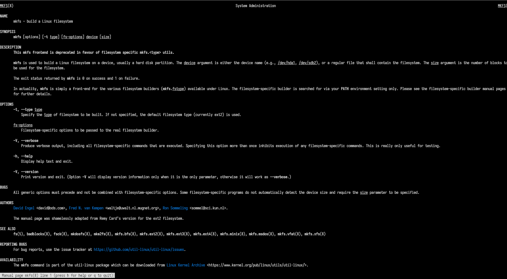{#fig:014 width=70%} 

## Контрольные вопросы

1. Дайте характеристику каждой файловой системе, существующей на жёстком диске компьютера, на котором вы выполняли лабораторную работу.
Ext2, Ext3, Ext4 или Extended Filesystem - это стандартная файловая система для Linux. Она была разработана еще для Minix. Она самая стабильная из всех существующих, кодовая база изменяется очень редко и эта файловая система содержит больше всего функций. Версия ext2 была разработана уже именно для Linux и получила много улучшений. В 2001 году вышла ext3, которая добавила еще больше стабильности благодаря использованию журналирования. В 2006 была выпущена версия ext4, которая используется во всех дистрибутивах Linux до сегодняшнего дня. В ней было внесено много улучшений, в том числе увеличен максимальный размер раздела до одного экзабайта.

NTFS — это файловая система по умолчанию, используемая операционными системами на базе Windows NT, начиная с 1993 года с Windows NT 3.1 и вплоть до Windows 11 включительно. Она предлагает расширенные функции, такие как права доступа к файлам, шифрование, сжатие и ведение журнала.

##

2. Приведите общую структуру файловой системы и дайте характеристику каждой директории первого уровня этой структуры.

/ — root каталог. Содержит в себе всю иерархию системы;
/bin — здесь находятся двоичные исполняемые файлы. Основные общие команды, хранящиеся отдельно от других программ в системе (прим.: pwd, ls, cat, ps);
/boot — тут расположены файлы, используемые для загрузки системы (образ initrd, ядро vmlinuz);
/dev — в данной директории располагаются файлы устройств (драйверов). С помощью этих файлов можно взаимодействовать с устройствами. К примеру, если это жесткий диск, можно подключить его к файловой системе. В файл принтера же можно написать напрямую и отправить задание на печать;
/etc — в этой директории находятся файлы конфигураций программ. Эти файлы позволяют настраивать системы, сервисы, скрипты системных демонов;
/home — каталог, аналогичный каталогу Users в Windows. Содержит домашние каталоги учетных записей пользователей (кроме root). При создании нового пользователя здесь создается одноименный каталог с аналогичным именем и хранит личные файлы этого пользователя;
/lib — содержит системные библиотеки, с которыми работают программы и модули ядра;
/lost+found — содержит файлы, восстановленные после сбоя работы системы. Система проведет проверку после сбоя и найденные файлы можно будет посмотреть в данном каталоге;
/media — точка монтирования внешних носителей. Например, когда вы вставляете диск в дисковод, он будет автоматически смонтирован в директорию /media/cdrom;
/mnt — точка временного монтирования. Файловые системы подключаемых устройств обычно монтируются в этот каталог для временного использования;
/opt — тут расположены дополнительные (необязательные) приложения. Такие программы обычно не подчиняются принятой иерархии и хранят свои файлы в одном подкаталоге (бинарные, библиотеки, конфигурации);
/proc — содержит файлы, хранящие информацию о запущенных процессах и о состоянии ядра ОС;

##

/root — директория, которая содержит файлы и личные настройки суперпользователя;
/run — содержит файлы состояния приложений. Например, PID-файлы или UNIX-сокеты;
/sbin — аналогично /bin содержит бинарные файлы. Утилиты нужны для настройки и администрирования системы суперпользователем;
/srv — содержит файлы сервисов, предоставляемых сервером (прим. FTP или Apache HTTP);
/sys — содержит данные непосредственно о системе. Тут можно узнать информацию о ядре, драйверах и устройствах;
/tmp — содержит временные файлы. Данные файлы доступны всем пользователям на чтение и запись. Стоит отметить, что данный каталог очищается при перезагрузке;
/usr — содержит пользовательские приложения и утилиты второго уровня, используемые пользователями, а не системой. Содержимое доступно только для чтения (кроме root). Каталог имеет вторичную иерархию и похож на корневой;
/var — содержит переменные файлы. Имеет подкаталоги, отвечающие за отдельные переменные. Например, логи будут храниться в /var/log, кэш в /var/cache, очереди заданий в /var/spool/ и так далее.

##

3. Какая операция должна быть выполнена, чтобы содержимое некоторой файловой системы было доступно операционной системе? Монтирование тома.

4. Назовите основные причины нарушения целостности файловой системы. Как устранить повреждения файловой системы? Отсутствие синхронизации между образом файловой системы в памяти и ее данными на диске в случае аварийного останова может привести к появлению следующих ошибок:

    Один блок адресуется несколькими mode (принадлежит нескольким файлам).
    Блок помечен как свободный, но в то же время занят (на него ссылается onode).
    Блок помечен как занятый, но в то же время свободен (ни один inode на него не ссылается).
    Неправильное число ссылок в inode (недостаток или избыток ссылающихся записей в каталогах).
    Несовпадение между размером файла и суммарным размером адресуемых inode блоков.
    Недопустимые адресуемые блоки (например, расположенные за пределами файловой системы).
    "Потерянные" файлы (правильные inode, на которые не ссылаются записи каталогов).
    Недопустимые или неразмещенные номера inode в записях каталогов.

##

5. Как создаётся файловая система?

mkfs - позволяет создать файловую систему Linux.

##

6. Дайте характеристику командам для просмотра текстовых файлов.

Cat - выводит содержимое файла на стандартное устройство вывода

##

7. Приведите основные возможности команды cp в Linux.

Cp – копирует или перемещает директорию, файлы.

8. Приведите основные возможности команды mv в Linux.

Mv - переименовать или переместить файл или директорию

9. Что такое права доступа? Как они могут быть изменены?

Права доступа к файлу или каталогу можно изменить, воспользовавшись командой chmod. Сделать это может владелец файла (или каталога) или пользователь с правами администратора.

## Выводы

Мы ознакомились с файловой системой Linux, её структурой, именами и содержанием
каталогов. Приобрели практические навыки по применению команд для работы
с файлами и каталогами, по управлению процессами (и работами), по проверке исполь-
зования диска и обслуживанию файловой системы.

# Список литературы{.unnumbered}

::: {#refs}
:::

