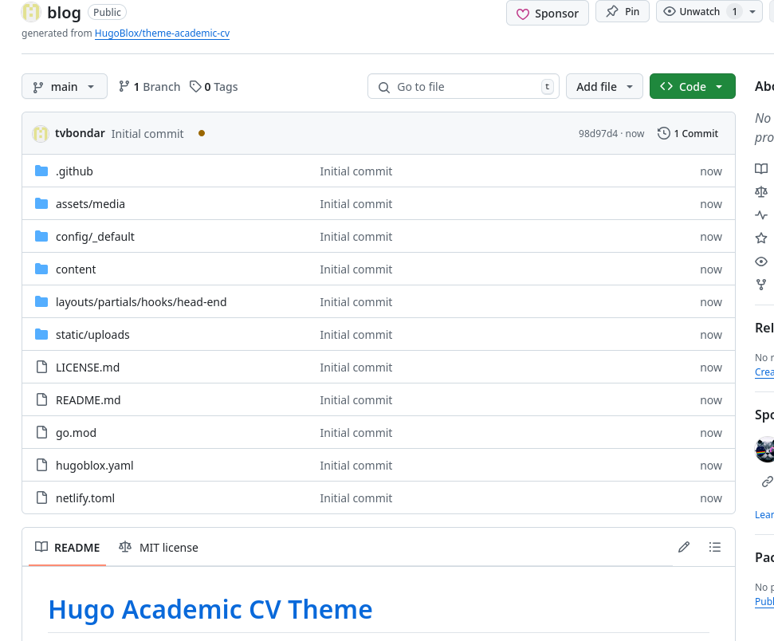
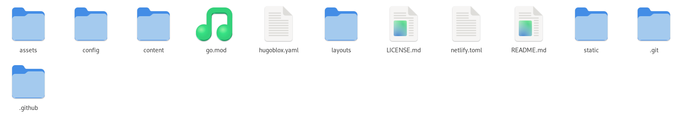
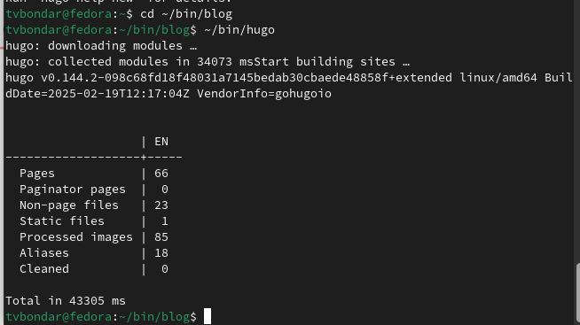
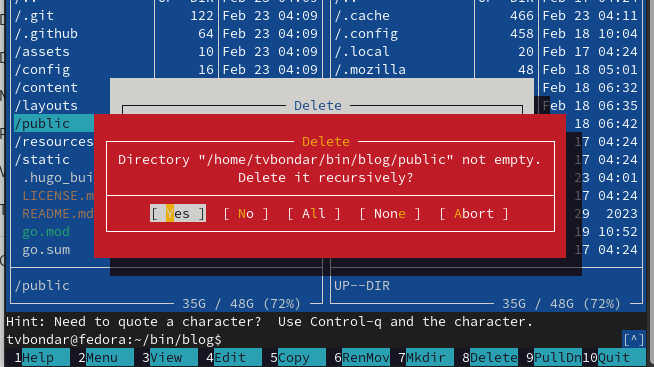
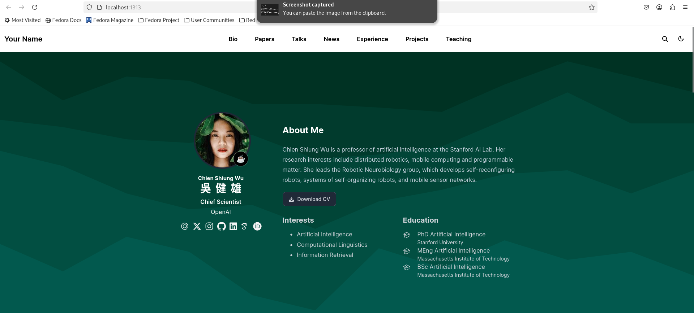
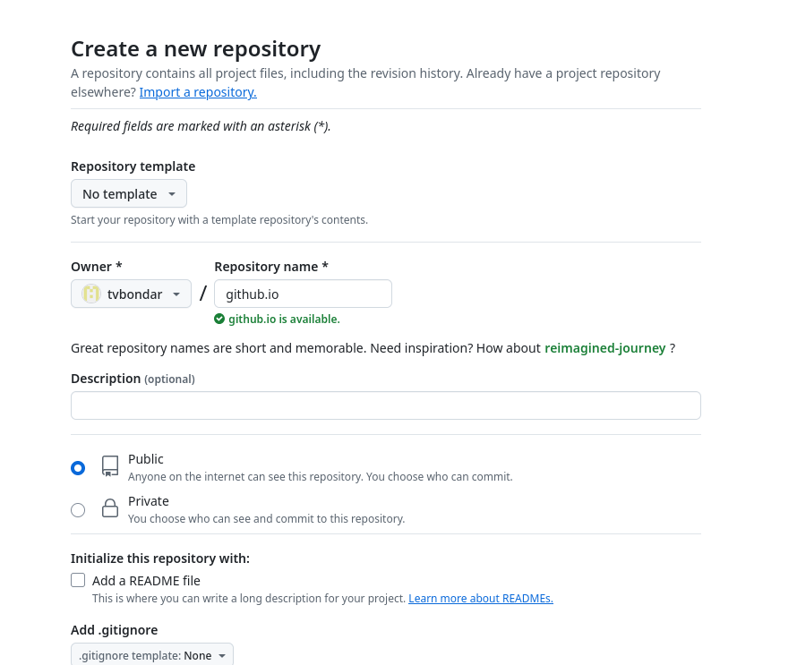
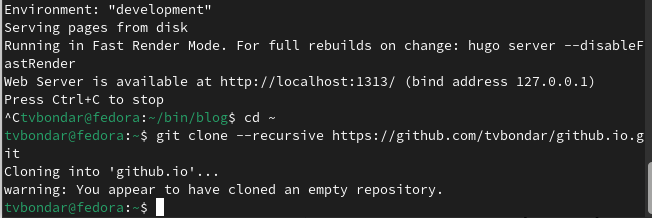
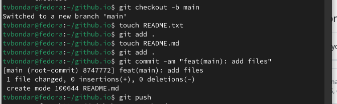

---
## Front matter
lang: ru-RU
title: "Отчет по индивидуальному проекту №1"
subtitle: "Операционные системы"
author:
  - Бондарь Т. В.
institute:
  - Российский университет дружбы народов, Москва, Россия

## i18n babel
babel-lang: russian
babel-otherlangs: english

## Formatting pdf
toc: false
toc-title: Содержание
slide_level: 2
aspectratio: 169
section-titles: true
theme: metropolis
header-includes:
 - \metroset{progressbar=frametitle,sectionpage=progressbar,numbering=fraction}
---

# Информация

## Докладчик

:::::::::::::: {.columns align=center}
::: {.column width="70%"}

  * Бондарь Татьяна Владимировна
  * НКАбд-01-24, студ. билет №1132246711
  * Российский университет дружбы народов
  * <https://github.com/tvbondar/study_2024-2025_os-intro>

:::
::: {.column width="30%"}
:::
::::::::::::::

## Цель работы

Научиться размещать сайт на Github pages. Выполнить первый этап индивидуального проекта.

## Задание

1. Установка необходимого ПО
2. Скачивание шаблона темы сайта
3. Размещение его на хостинге Git
4. Установка параметра для URL сайта
5. Размещение загатовки сайта на Github pages

# Выполнение индивидуального проекта. Установка необходимого ПО

1. Скачиваю последнюю версию исполняемого файла hugo для своей операционной системы.  

{#fig:001 width=70%}

##

2. Распаковываю  архив с исполняемым файлом 

{#fig:002 width=70%}

##

3. Создаю в домашнем каталоге папку bin, в нее перекладываю исполняемый файл hugo.  

{#fig:003 width=70%}

## Скачивание шаблона темы сайта

4. Создаю свой репозиторий под назвнием blog на основе шаблона Hugo blox 

{#fig:004 width=70%}

##

5. Клонирою созданный репозиторий себе в локальный.  

{#fig:005 width=70%}

## Размещение его на хостинге Git

6. Запускаю исполняемый файл.  

{#fig:006 width=70%}

##

7. Удаляю папку public, мы создадим свою. 

{#fig:007 width=70%}

##

8. Запускаю исполняемый файл с командой server  

{#fig:008 width=70%}

##

9. Получаем страницу сайта на локальном сервере.  

{#fig:009 width=70%}

## Установка параметра для URL сайта

10.  Создаю новый репозиторий. Имя репозитория - адрес сайта.  

{#fig:010 width=70%} 

##

11. Клонирую репозиторий  

{#fig:011 width=70%}

##

12. Создаю главную ветку main  

{#fig:012 width=70%}

##

13. Создаю пустой файл README.md и отправляю изменения в глобальный репозиторий.  

{#fig:013 width=70%}

##

14. Подключаю репозиторий github.io к каталогу public  

{#fig:014 width=70%}

##

15. Снова запускаю исполняемый файл.  

{#fig:015 width=70%}

## Размещение загатовки сайта на Github pages

16. Проверяю есть ли полдключение между public и tvbondar.github.io, после чего отправляю изменения на глобальный репозиторий. 

{#fig:016 width=70%}

##

17. Проверяю, сохранились ли изменения.  

{#fig:017 width=70%}

## Выводы

Мы научились размещать сайт на Github pages, выполнили первый этап индивидуального проекта.

## Список литературы{.unnumbered}

::: {#refs}
:::

