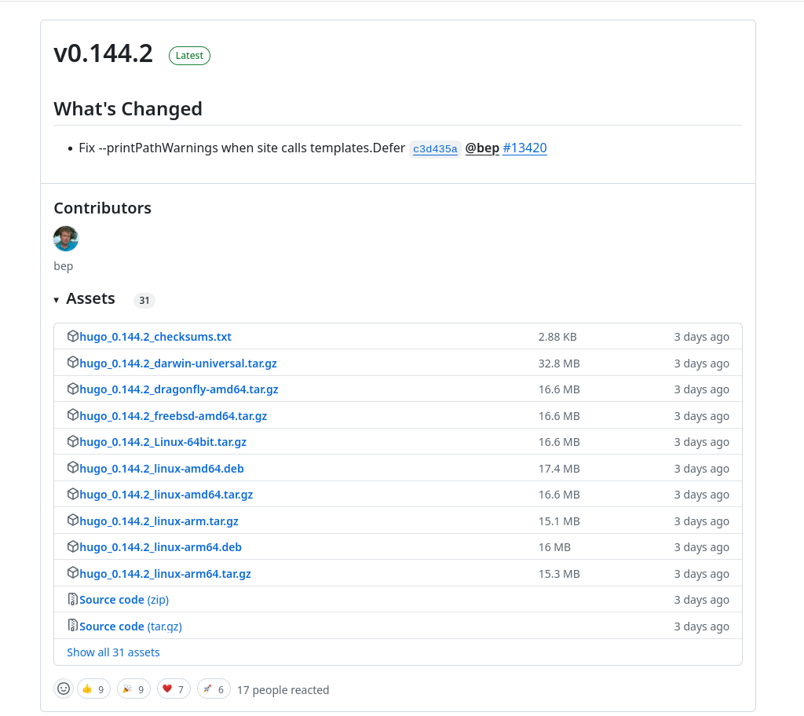
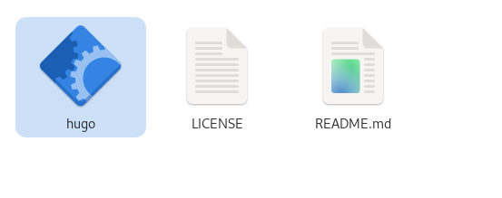
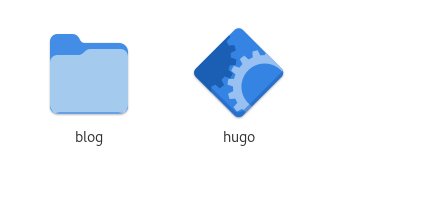
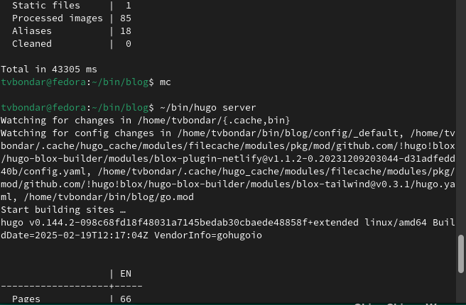
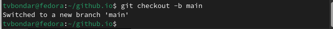
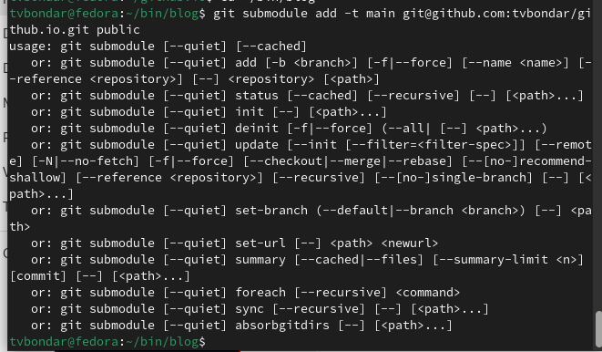
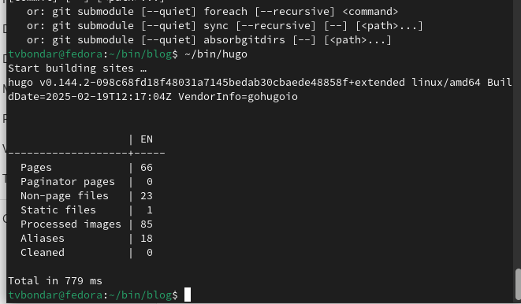
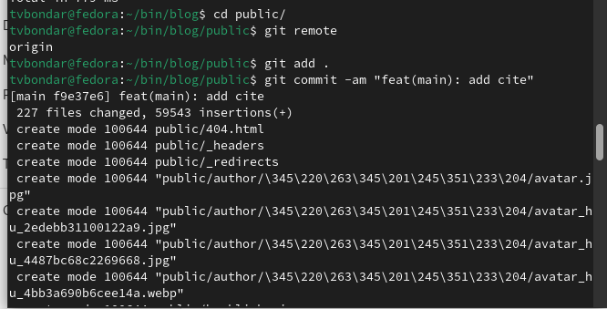
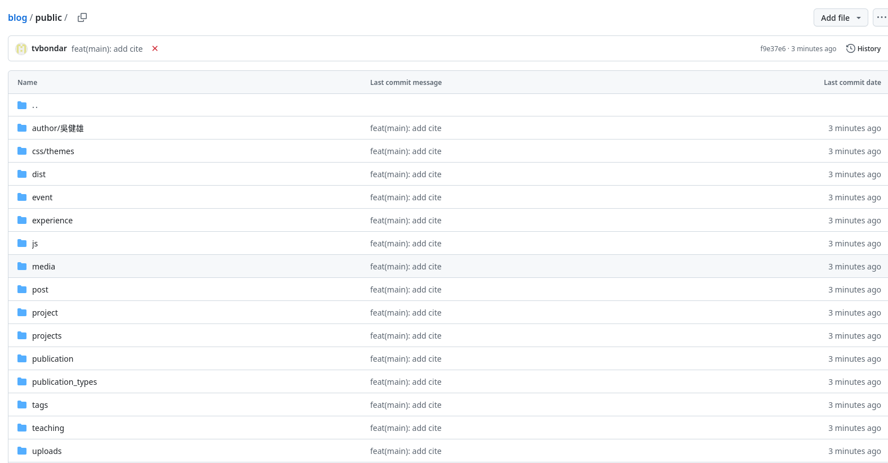

---
## Front matter
title: "Отчет по индивидуальному проекту №1"
subtitle: "Операционные системы"
author: "Бондарь Татьяна Владимировна"

## Generic otions
lang: ru-RU
toc-title: "Содержание"

## Bibliography
bibliography: bib/cite.bib
csl: pandoc/csl/gost-r-7-0-5-2008-numeric.csl

## Pdf output format
toc: true # Table of contents
toc-depth: 2
lof: true # List of figures
lot: true # List of tables
fontsize: 12pt
linestretch: 1.5
papersize: a4
documentclass: scrreprt
## I18n polyglossia
polyglossia-lang:
  name: russian
  options:
	- spelling=modern
	- babelshorthands=true
polyglossia-otherlangs:
  name: english
## I18n babel
babel-lang: russian
babel-otherlangs: english
## Fonts
mainfont: IBM Plex Serif
romanfont: IBM Plex Serif
sansfont: IBM Plex Sans
monofont: IBM Plex Mono
mathfont: STIX Two Math
mainfontoptions: Ligatures=Common,Ligatures=TeX,Scale=0.94
romanfontoptions: Ligatures=Common,Ligatures=TeX,Scale=0.94
sansfontoptions: Ligatures=Common,Ligatures=TeX,Scale=MatchLowercase,Scale=0.94
monofontoptions: Scale=MatchLowercase,Scale=0.94,FakeStretch=0.9
mathfontoptions:
## Biblatex
biblatex: true
biblio-style: "gost-numeric"
biblatexoptions:
  - parentracker=true
  - backend=biber
  - hyperref=auto
  - language=auto
  - autolang=other*
  - citestyle=gost-numeric
## Pandoc-crossref LaTeX customization
figureTitle: "Рис."
tableTitle: "Таблица"
listingTitle: "Листинг"
lofTitle: "Список иллюстраций"
lotTitle: "Список таблиц"
lolTitle: "Листинги"
## Misc options
indent: true
header-includes:
  - \usepackage{indentfirst}
  - \usepackage{float} # keep figures where there are in the text
  - \floatplacement{figure}{H} # keep figures where there are in the text
---

# Цель работы

Научиться размещать сайт на Github pages. Выполнить первый этап индивидуального проекта.

# Задание

1. Установка необходимого ПО
2. Скачивание шаблона темы сайта
3. Размещение его на хостинге Git
4. Установка параметра для URL сайта
5. Размещение загатовки сайта на Github pages

# Выполнение индивидуального проекта

## Установка необходимого ПО

1. Скачиваю последнюю версию исполняемого файла hugo для своей операционной системы.  (рис. @fig:001).

{#fig:001 width=70%}

2. Распаковываю  архив с исполняемым файлом (рис. @fig:002).

{#fig:002 width=70%}

3. Создаю в домашнем каталоге папку bin, в нее перекладываю исполняемый файл hugo.  (рис. @fig:003).

{#fig:003 width=70%}

## Скачивание шаблона темы сайта

4. Создаю свой репозиторий под назвнием blog на основе шаблона Hugo blox (рис. @fig:004).

{#fig:004 width=70%}

5. Клонирою созданный репозиторий себе в локальный.  (рис. @fig:005).

{#fig:005 width=70%}

## Размещение его на хостинге Git

6. Запускаю исполняемый файл.  (рис. @fig:006).

{#fig:006 width=70%}

7. Удаляю папку public, мы создадим свою.  (рис. @fig:007).

{#fig:007 width=70%}

8. Запускаю исполняемый файл с командой server  (рис. @fig:008).

{#fig:008 width=70%}

9. Получаем страницу сайта на локальном сервере.  (рис. @fig:009).

{#fig:009 width=70%}

## Установка параметра для URL сайта

10.  Создаю новый репозиторий. Имя репозитория - адрес сайта.  (рис. @fig:010).

{#fig:010 width=70%} 

11. Клонирую репозиторий  (рис. @fig:011).

{#fig:011 width=70%}

12. Создаю главную ветку main  (рис. @fig:012).

{#fig:012 width=70%}

13. Создаю пустой файл README.md и отправляю изменения в глобальный репозиторий.  (рис. @fig:013).

{#fig:013 width=70%}

14. Подключаю репозиторий github.io к каталогу public  (рис. @fig:014).

{#fig:014 width=70%}

15. Снова запускаю исполняемый файл.  (рис. @fig:015).

{#fig:015 width=70%}

## Размещение загатовки сайта на Github pages

16. Проверяю есть ли полдключение между public и tvbondar.github.io, после чего отправляю изменения на глобальный репозиторий.  (рис. @fig:016).

{#fig:016 width=70%}

17. Проверяю, сохранились ли изменения.  (рис. @fig:017).

{#fig:017 width=70%}

# Выводы

Мы научились размещать сайт на Github pages, выполнили первый этап индивидуального проекта.

# Список литературы{.unnumbered}
 

::: {#refs}
:::
