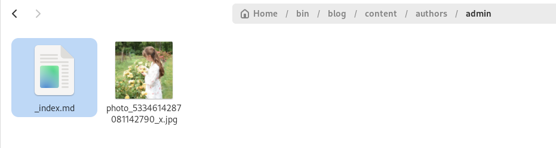
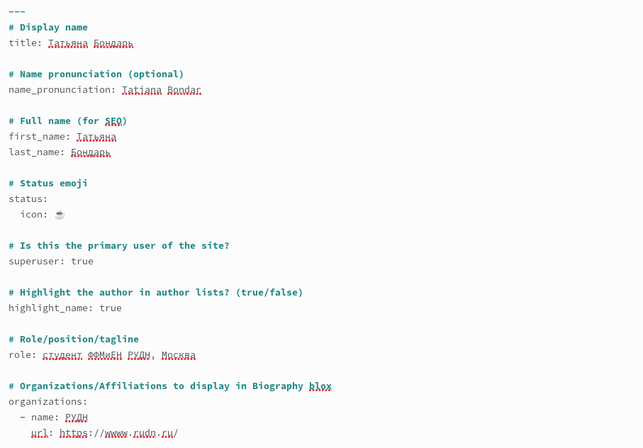
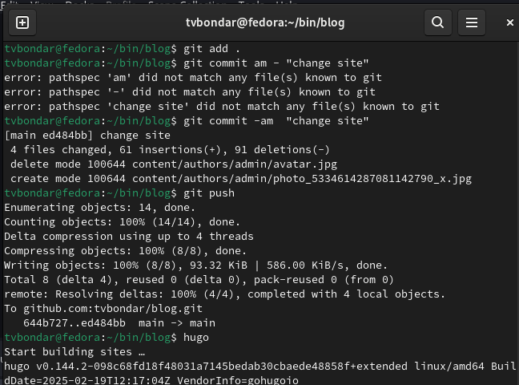
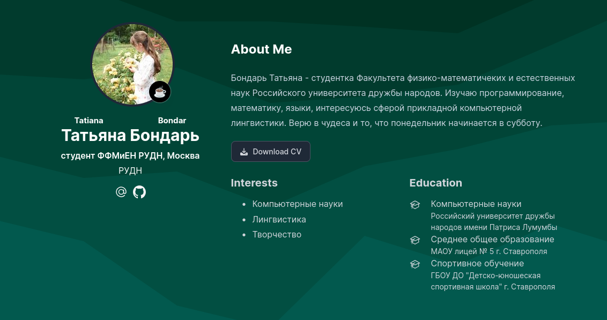
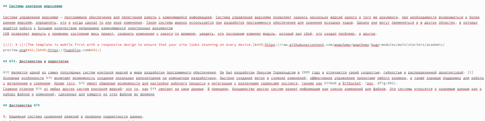
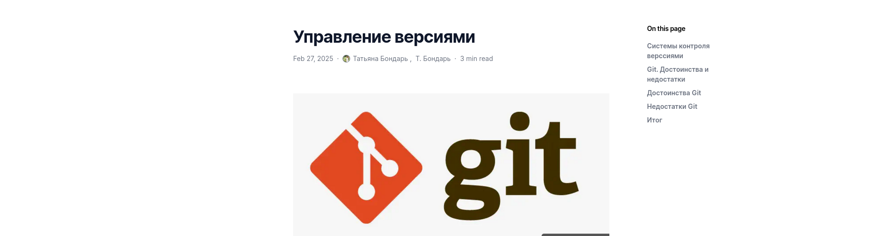
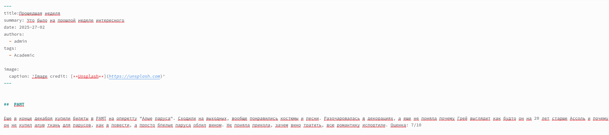
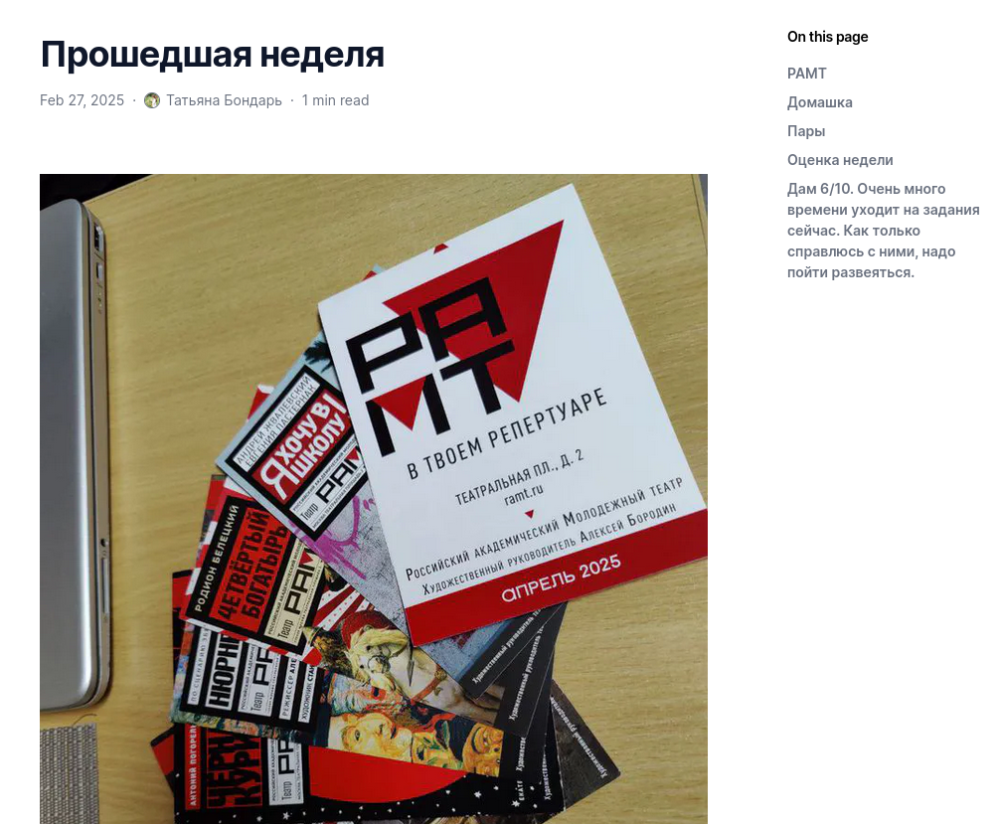
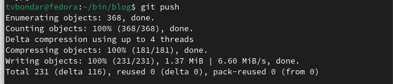
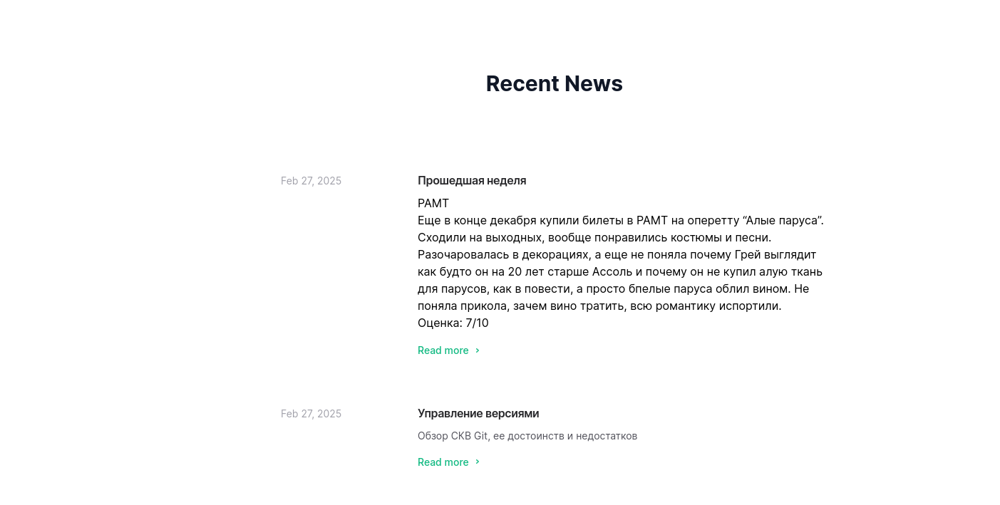

---
## Front matter
lang: ru-RU
title: "Отчет по индивидуальному проекту №2"
subtitle: "Операционные системы"
author:
  - Бондарь Т. В.
institute:
  - Российский университет дружбы народов, Москва, Россия

## i18n babel
babel-lang: russian
babel-otherlangs: english

## Formatting pdf
toc: false
toc-title: Содержание
slide_level: 2
aspectratio: 169
section-titles: true
theme: metropolis
header-includes:
 - \metroset{progressbar=frametitle,sectionpage=progressbar,numbering=fraction}
---

# Информация

## Докладчик

:::::::::::::: {.columns align=center}
::: {.column width="70%"}

  * Бондарь Татьяна Владимировна
  * НКАбд-01-24, студ. билет №1132246711
  * Российский университет дружбы народов
  * <https://github.com/tvbondar/study_2024-2025_os-intro>

:::
::: {.column width="30%"}
:::
::::::::::::::

## Цель работы

Продолжить работу с сайтом, редактировать его в соответствии с требованиями, добавить данные о себе на сайт.

# Задание

1. Разместить фотографию владельца сайта.
2. Разместить краткое описание владельца сайта (Biography).
3. Добавить информацию об интересах (Interests).
4. Добавить информацию от образовании (Education).
5. Сделать пост по прошедшей неделе.
6. Добавить пост на тему по выбору: Управление версиями. Git. Непрерывная интеграция и непрерывное развертывание (CI/CD).

# Выполнение индивидуального проекта

1. Переношу свою фотографию в нужный каталог.  

{#fig:001 width=70%}

##

2. В файле index.md заполняю данные о себе. Добавляю информацию об интересах и образовании. 

{#fig:002 width=70%}

##

3. Отправляю изменения на глобальный репозиторий 

{#fig:003 width=70%}

##

4. Проверяю изменения на сайте 

{#fig:004 width=70%}

##

5. Пишу пост на тему по выбору.  

{#fig:005 width=70%}

##

6. Проверяю изменения на сайте.  

{#fig:006 width=70%}

##

7. Пишу пост по прошедшей неделе. 

{#fig:007 width=70%}

##

8. Проверяю изменения на сайте  

{#fig:008 width=70%}

##

9. Отправляю изменения на глобальный репозиторий.  

{#fig:009 width=70%}

##

10.  Проверяю внешний вид сайта.  

{#fig:010 width=70%} 

## Выводы

Мы продолжили работу с сайтом, редактировали его в соответствии с требованиями, добавили данные о себе на сайт.

## Список литературы{.unnumbered}

::: {#refs}
:::

