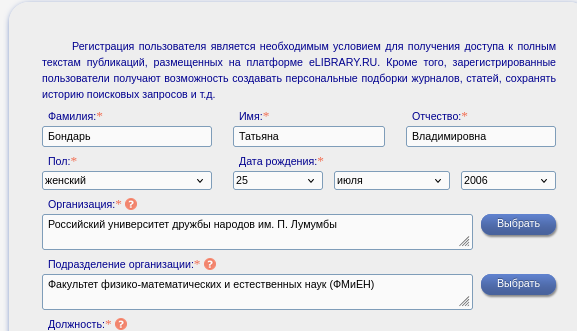
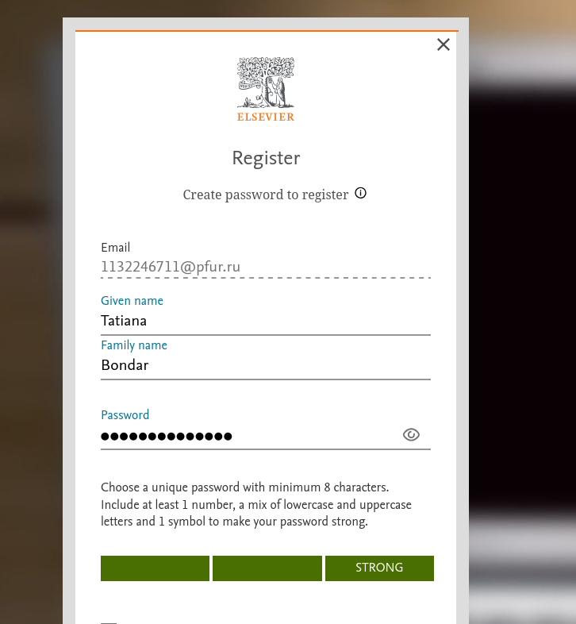
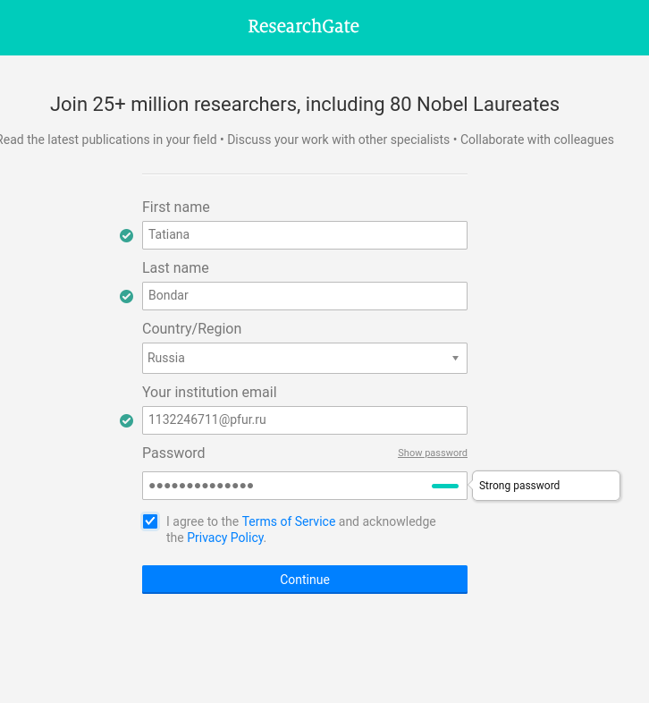
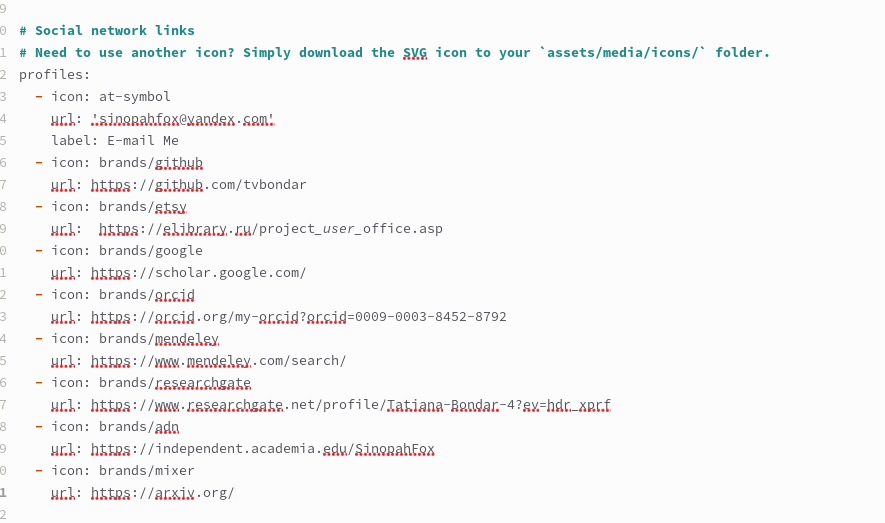
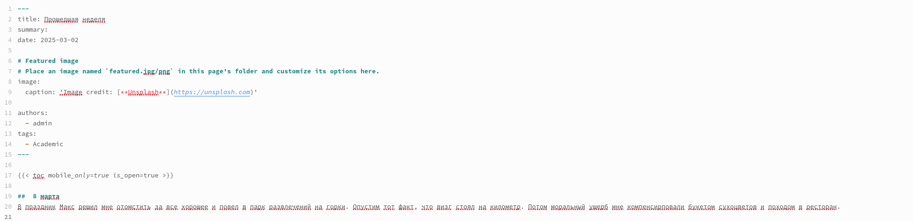
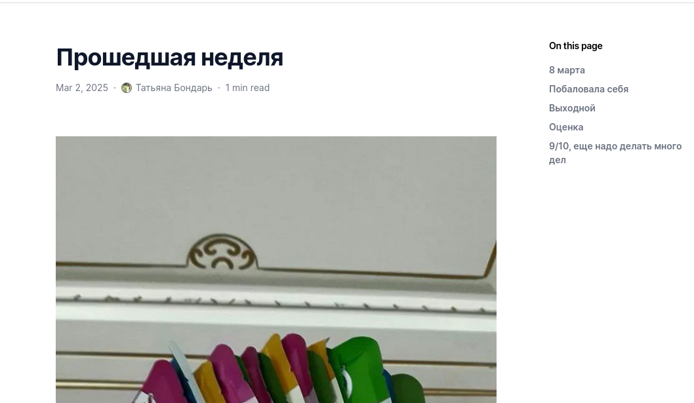
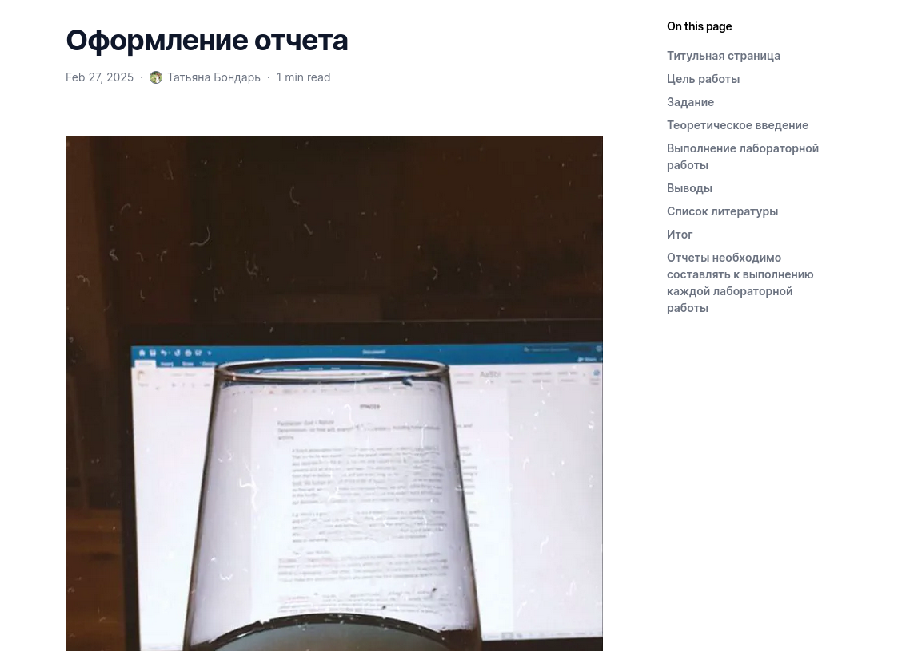

---
## Front matter
lang: ru-RU
title: "Отчет по индивидуальному проекту №4"
subtitle: "Операционные системы"
author:
  - Бондарь Т. В.
institute:
  - Российский университет дружбы народов, Москва, Россия

## i18n babel
babel-lang: russian
babel-otherlangs: english

## Formatting pdf
toc: false
toc-title: Содержание
slide_level: 2
aspectratio: 169
section-titles: true
theme: metropolis
header-includes:
 - \metroset{progressbar=frametitle,sectionpage=progressbar,numbering=fraction}
---

# Информация

## Докладчик

:::::::::::::: {.columns align=center}
::: {.column width="70%"}

  * Бондарь Татьяна Владимировна
  * НКАбд-01-24, студ. билет №1132246711
  * Российский университет дружбы народов
  * <https://github.com/tvbondar/study_2024-2025_os-intro>

:::
::: {.column width="30%"}
:::
::::::::::::::

## Цель работы
Продолжить работу с сайтом, добавить к сайту ссылки на научные и библиометрические ресурсы, сделать пост по выбору и по прошедшей неделе.

# Задание

1. Зарегистрироваться на соответствующих ресурсах и разместить на них ссылки на сайте: eLibrary : https://elibrary.ru/; Google Scholar : https://scholar.google.com/; ORCID : https://orcid.org/; Mendeley : https://www.mendeley.com/; ResearchGate : https://www.researchgate.net/; Academia.edu : https://www.academia.edu/; arXiv : https://arxiv.org/; github : https://github.com/.
2. Сделать пост по прошедшей неделе.
3. Добавить пост на тему по выбору: Оформление отчёта. Создание презентаций. Работа с библиографией.

# Выполнение индивидуального проекта

1. Регистрируюсь на ресурсах, указанных в задании.  

{#fig:001 width=70%}

##

{#fig:002 width=70%}

##

{#fig:003 width=70%}

##

{#fig:004 width=70%}

##

{#fig:005 width=70%}

##

{#fig:006 width=70%}

##

{#fig:007 width=70%}

##

2. Размещаю ссылки на ресурсы на своем сайте

{#fig:008 width=70%}

##

{#fig:009 width=70%}

##

3. Пишу пост по прошедшей неделе 

{#fig:010 width=70%}

##

{#fig:011 width=70%}

##

4. Пишу пост на тему по выбору. .

{#fig:012 width=70%}

##

{#fig:013 width=70%}

# Выводы

Мы продолжили работу с сайтом, добавили к сайту ссылки на научные и библиометрические ресурсы, сделали пост по выбору и по прошедшей неделе.

## Список литературы{.unnumbered}

::: {#refs}
:::

