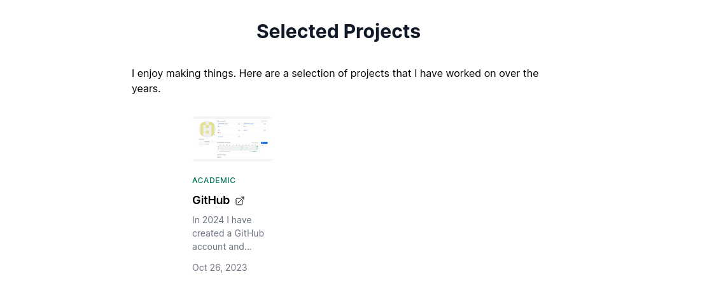
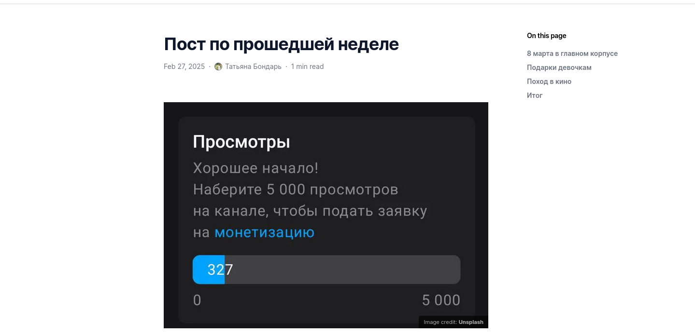

---
## Front matter
lang: ru-RU
title: "Отчет по индивидуальному проекту №5"
subtitle: "Операционные системы"
author:
  - Бондарь Т. В.
institute:
  - Российский университет дружбы народов, Москва, Россия

## i18n babel
babel-lang: russian
babel-otherlangs: english

## Formatting pdf
toc: false
toc-title: Содержание
slide_level: 2
aspectratio: 169
section-titles: true
theme: metropolis
header-includes:
 - \metroset{progressbar=frametitle,sectionpage=progressbar,numbering=fraction}
---

# Информация

## Докладчик

:::::::::::::: {.columns align=center}
::: {.column width="70%"}

  * Бондарь Татьяна Владимировна
  * НКАбд-01-24, студ. билет №1132246711
  * Российский университет дружбы народов
  * <https://github.com/tvbondar/study_2024-2025_os-intro>

:::
::: {.column width="30%"}
:::
::::::::::::::

## Цель работы

Продолжить работу с сайтом, добавить к сайту записи для персональных проектов, сделать пост по прошлой неделе и по языкам научного программирования.

# Задание

1. Сделать записи для персональных проектов.
2. Сделать пост по прошедшей неделе.
3. Добавить пост на тему по выбору. Языки научного программирования.

# Выполнение индивидуального проекта

1. Добавляю к сайту записи для индивидуальных проектов. У меня это GitHub. Проверяю изменения на сайте 

{#fig:001 width=70%}

##

{#fig:002 width=70%}

##

2. Пишу пост по прошедшей неделе. Проверяю изменения 

{#fig:003 width=70%}

##

{#fig:004 width=70%}

##

3. Пишу пост на тему по выбору. 

{#fig:005 width=70%}

##

{#fig:006 width=70%}

# Выводы

Мы продолжили работу с сайтом, добавили к сайту записи для индивидуального проекта, сделали пост по выбору и по прошедшей неделе.

## Список литературы{.unnumbered}

::: {#refs}
:::

