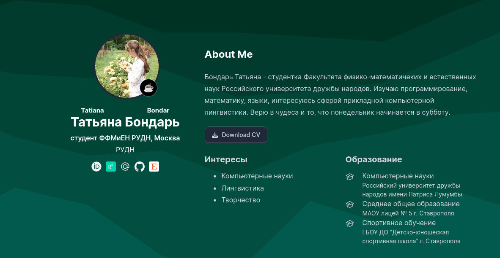
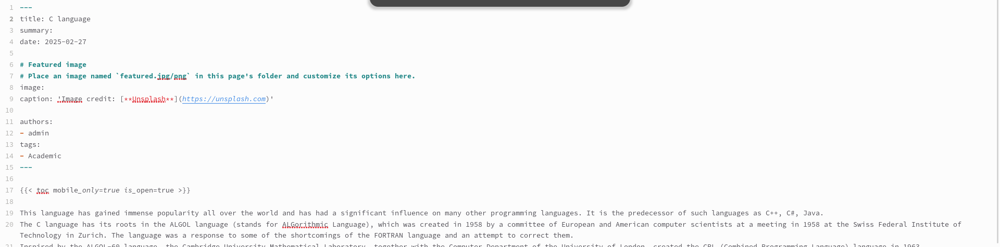
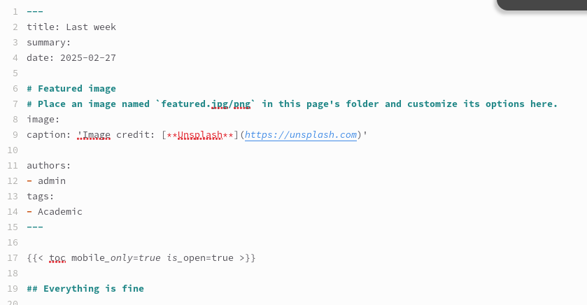

---
## Front matter
lang: ru-RU
title: "Отчет по индивидуальному проекту №6"
subtitle: "Операционные системы"
author:
  - Бондарь Т. В.
institute:
  - Российский университет дружбы народов, Москва, Россия

## i18n babel
babel-lang: russian
babel-otherlangs: english

## Formatting pdf
toc: false
toc-title: Содержание
slide_level: 2
aspectratio: 169
section-titles: true
theme: metropolis
header-includes:
 - \metroset{progressbar=frametitle,sectionpage=progressbar,numbering=fraction}
---

# Информация

## Докладчик

:::::::::::::: {.columns align=center}
::: {.column width="70%"}

  * Бондарь Татьяна Владимировна
  * НКАбд-01-24, студ. билет №1132246711
  * Российский университет дружбы народов
  * <https://github.com/tvbondar/study_2024-2025_os-intro>

:::
::: {.column width="30%"}
:::
::::::::::::::

## Цель работы

Продолжить работу с сайтом, Разместить двуязычный сайт на Github.

# Задание

1. Сделать поддержку английского и русского языков.
2. Разместить элементы сайта на обоих языках.
3. Разместить контент на обоих языках.
4. Сделать пост по прошедшей неделе.
5. Добавить пост на тему по выбору (на двух языках).

## Выполнение индивидуального проекта

1. ДДелаю поддержку двух языков. Во первых, скачиваю файл с поддержкой русского языка ru.yaml, размещаю его в каталоге i18n. Редактирую файл language.yaml.  

{#fig:001 width=70%}

##

2. Создаю в каталоге content две папки, в которых хранится содержимое сайта на двух языках, перевожу все данные на нужный язык 

{#fig:002 width=70%}

##

3. Проверяю изменения на сайте 

{#fig:003 width=70%}

##

{#fig:004 width=70%}

##

3. Пишу пост на тему по выбору на двух языках. 

{#fig:005 width=70%}

##

{#fig:006 width=70%}

##

{#fig:007 width=70%}

##

{#fig:008 width=70%}

##

4. Пишу пост по прошедшей неделе на двух языках.

{#fig:009 width=70%}

##

{#fig:010 width=70%}

##

{#fig:011 width=70%}

##

{#fig:012 width=70%}

# Выводы

Мы продолжили работу с сайтом, разместили двуязычный сайт на Github.

## Список литературы{.unnumbered}

::: {#refs}
:::

