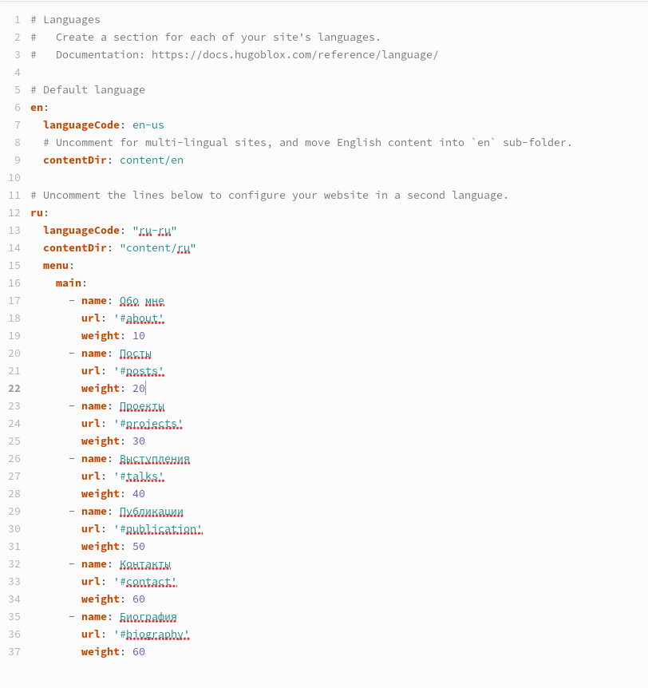
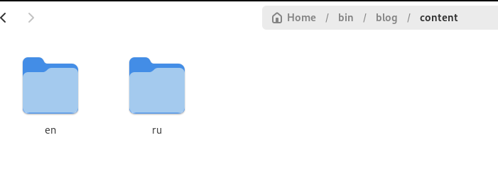
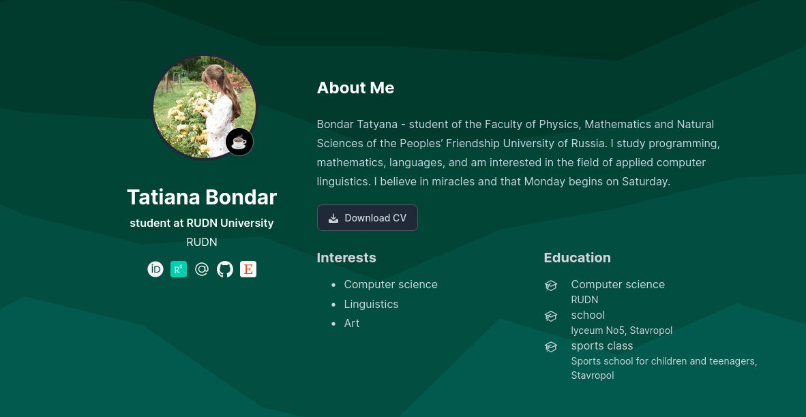
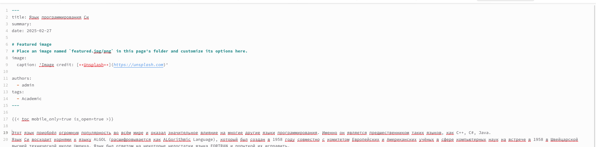
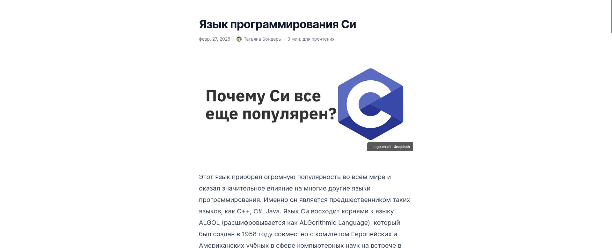
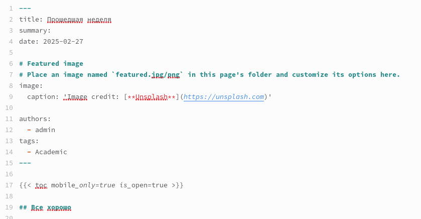
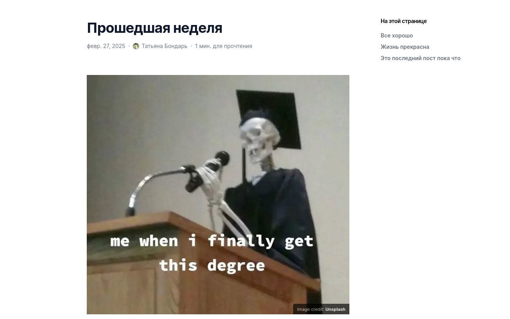

---
## Front matter
title: "Отчет по индивидуальному проекту №6"
subtitle: "Операционные системы"
author: "Бондарь Татьяна Владимировна"

## Generic otions
lang: ru-RU
toc-title: "Содержание"

## Bibliography
bibliography: bib/cite.bib
csl: pandoc/csl/gost-r-7-0-5-2008-numeric.csl

## Pdf output format
toc: true # Table of contents
toc-depth: 2
lof: true # List of figures
lot: true # List of tables
fontsize: 12pt
linestretch: 1.5
papersize: a4
documentclass: scrreprt
## I18n polyglossia
polyglossia-lang:
  name: russian
  options:
	- spelling=modern
	- babelshorthands=true
polyglossia-otherlangs:
  name: english
## I18n babel
babel-lang: russian
babel-otherlangs: english
## Fonts
mainfont: IBM Plex Serif
romanfont: IBM Plex Serif
sansfont: IBM Plex Sans
monofont: IBM Plex Mono
mathfont: STIX Two Math
mainfontoptions: Ligatures=Common,Ligatures=TeX,Scale=0.94
romanfontoptions: Ligatures=Common,Ligatures=TeX,Scale=0.94
sansfontoptions: Ligatures=Common,Ligatures=TeX,Scale=MatchLowercase,Scale=0.94
monofontoptions: Scale=MatchLowercase,Scale=0.94,FakeStretch=0.9
mathfontoptions:
## Biblatex
biblatex: true
biblio-style: "gost-numeric"
biblatexoptions:
  - parentracker=true
  - backend=biber
  - hyperref=auto
  - language=auto
  - autolang=other*
  - citestyle=gost-numeric
## Pandoc-crossref LaTeX customization
figureTitle: "Рис."
tableTitle: "Таблица"
listingTitle: "Листинг"
lofTitle: "Список иллюстраций"
lotTitle: "Список таблиц"
lolTitle: "Листинги"
## Misc options
indent: true
header-includes:
  - \usepackage{indentfirst}
  - \usepackage{float} # keep figures where there are in the text
  - \floatplacement{figure}{H} # keep figures where there are in the text
---

# Цель работы

Продолжить работу с сайтом, Разместить двуязычный сайт на Github.

# Задание

1. Сделать поддержку английского и русского языков.
2. Разместить элементы сайта на обоих языках.
3. Разместить контент на обоих языках.
4. Сделать пост по прошедшей неделе.
5. Добавить пост на тему по выбору (на двух языках).

# Выполнение индивидуального проекта

1. ДДелаю поддержку двух языков. Во первых, скачиваю файл с поддержкой русского языка ru.yaml, размещаю его в каталоге i18n. Редактирую файл language.yaml.  (рис. @fig:001).  

{#fig:001 width=70%}

2. Создаю в каталоге content две папки, в которых хранится содержимое сайта на двух языках, перевожу все данные на нужный язык (рис. @fig:002).  

{#fig:002 width=70%}

3. Проверяю изменения на сайте (рис. @fig:003). (рис. @fig:004).

{#fig:003 width=70%}

{#fig:004 width=70%}

3. Пишу пост на тему по выбору на двух языках. (рис. @fig:005). (рис. @fig:006).(рис. @fig:007). (рис. @fig:008).

{#fig:005 width=70%}

{#fig:006 width=70%}

{#fig:007 width=70%}

{#fig:008 width=70%}

4. Пишу пост по прошедшей неделе на двух языках.(рис. @fig:009). (рис. @fig:010).(рис. @fig:011). (рис. @fig:012).

{#fig:009 width=70%}

{#fig:010 width=70%}

{#fig:011 width=70%}

{#fig:012 width=70%}

# Выводы

Мы продолжили работу с сайтом, разместили двуязычный сайт на Github.

# Список литературы{.unnumbered}
 

::: {#refs}
:::
