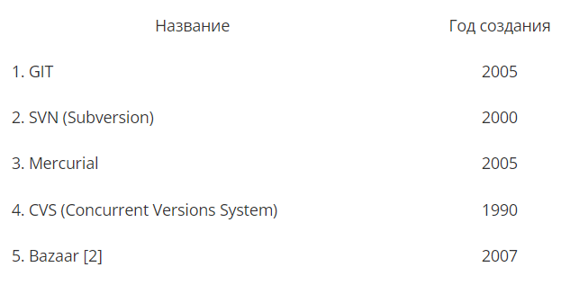
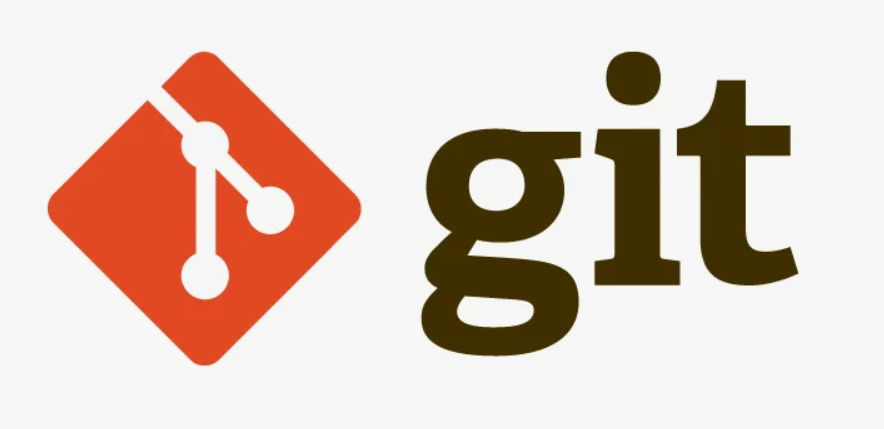

---
## Front matter
title: "Доклад к лекции №4"
subtitle: "Сравнение систем управления версиями git, mercurial и bazaar."
author: "Бондарь Татьяна Владимировна"

## Generic otions
lang: ru-RU
toc-title: "Содержание"

## Bibliography
bibliography: bib/cite.bib
csl: pandoc/csl/gost-r-7-0-5-2008-numeric.csl

## Pdf output format
toc: true # Table of contents
toc-depth: 2
lof: true # List of figures
lot: true # List of tables
fontsize: 12pt
linestretch: 1.5
papersize: a4
documentclass: scrreprt
## I18n polyglossia
polyglossia-lang:
  name: russian
  options:
	- spelling=modern
	- babelshorthands=true
polyglossia-otherlangs:
  name: english
## I18n babel
babel-lang: russian
babel-otherlangs: english
## Fonts
mainfont: PT Serif
romanfont: PT Serif
sansfont: PT Sans
monofont: PT Mono
mainfontoptions: Ligatures=TeX
romanfontoptions: Ligatures=TeX
sansfontoptions: Ligatures=TeX,Scale=MatchLowercase
monofontoptions: Scale=MatchLowercase,Scale=0.9
## Biblatex
biblatex: true
biblio-style: "gost-numeric"
biblatexoptions:
  - parentracker=true
  - backend=biber
  - hyperref=auto
  - language=auto
  - autolang=other*
  - citestyle=gost-numeric
## Pandoc-crossref LaTeX customization
figureTitle: "Рис."
tableTitle: "Таблица"
listingTitle: "Листинг"
lofTitle: "Список иллюстраций"
lotTitle: "Список таблиц"
lolTitle: "Листинги"
## Misc options
indent: true
header-includes:
  - \usepackage{indentfirst}
  - \usepackage{float} # keep figures where there are in the text
  - \floatplacement{figure}{H} # keep figures where there are in the text
---
# Введение

Системы контроля версий (СКВ) играют важную роль в разработке программного обеспечения, управлении проектами и работе с документацией. Они предназначены для отслеживания изменений в файлах и папках, а также управления версиями исходного кода, документов и других ресурсов. С помощью систем контроля версий разработчики могут сотрудничать, отслеживать изменения, возвращаться к предыдущим версиям и устранять конфликты. Существует несколько популярных СКВ, каждая из которых имеет свои особенности и преимущества.
В данном докладе мы рассмотрим такие системы контроля версий, как Git, Mercurial, Bazaar, и проведем сравнительный анализ их характеристик. Это **Цель нашего исследования**. 
**Гипотеза**: каждая из исследуемых СКВ имеет свои преимущества и недостатки и специализированна для решения опредененного типа задач. 
**Задача исследования** - доказать поставленную гипотезу.
**Актуальность** темы доклада обуславливается широким исспользованием СКВ в разработке ПО. **Объект исследования** - Системы контроля версий (СКВ). Конкретно, Git, Mercurial и Bazaar.
**Предмет исследования**: Сравнение функциональных возможностей, производительности, удобства использования,  и других ключевых характеристик СКВ Git, Mercurial и Bazaar.
**Научная новизна** - Изучение характеристик Git, Mercurial и Bazaar во времени, выявление общих тенденций и различий в их архитектуре и функциональности, 
**Материалы исследования** - статьи и публикации в сети Internet.
**Метод исследования** - Сравнительный анализ.
**Инструмент исследования** - Системы контроля версий.
**Теоретическая база** - Теория систем контроля версий.

# Основная часть

## Что такое система управления версиями и зачем она нужна

Система управления версиями — программное обеспечение для облегчения работы с изменяющейся информацией. Система управления версиями позволяет хранить несколько версий одного и того же документа, при необходимости возвращаться к более ранним версиям, определять, кто и когда сделал то или иное изменение. Такие системы широко используются при разработке программного обеспечения для хранения исходных кодов. Однако они могут применяться и в других областях, в которых ведётся работа с большим количеством непрерывно изменяющихся электронных документов 
СКВ позволяет вернуть к прежнему состоянию весь проект, сравнить изменения с какого-то времени, увидеть, кто последним изменял модуль, который дал сбой, кто создал проблему, и другое. (рис. @fig:001).

{#fig:001 width=70%}

## Git. Достоинства и недостатки

Git является одной из самых популярных систем контроля версий в мире разработки программного обеспечения. Он был разработан Линусом Торвальдсом в 2005 году и отличается своей скоростью, гибкостью и распределенной архитектурой. [1]
Основные особенности Git включают возможность создания локальных репозиториев на компьютере разработчика, быстрое создание веток и слияние изменений, эффективное управление проектами любого размера, а также хорошую поддержку для работы с ветвлением и слиянием. Кроме того, Git имеет обширные возможности для настройки рабочего процесса и интеграции с различными сервисами хостинга, такими как GitHub и Bitbucket. (рис. @fig:002). 

{#fig:002 width=70%}

Главное отличие Git от любых других систем контроля версий— это то, как Git смотрит на свои данные. В принципе, большинство других систем хранит информацию как список изменений для файлов. Эти системы относятся к хранимым данным как к набору файлов и изменений, сделанных для каждого из этих файлов во времени 

### Достоинства Git

1. Надежная система сравнения ревизий и проверки корректности данных.
2. Гибкая система ветвления проектов и слияния веток между собой.
3. Наличие локального репозитория, содержащего полную информацию обо всех изменениях, позволяет вести полноценный локальный контроль версий и заливать в главный репозиторий только полностью прошедшие проверку изменения.
4. Высокая производительность и скорость работы.
5. Удобный и интуитивно понятный набор команд.
6. Множество графических оболочек.
7. Возможность делать контрольные точки, в которых данные сохраняются не при помощи дельта компрессии, а полностью. Благодаря этому скорость восстановления данных уменьшается, так как за основу берется ближайшая контрольная точка, следовательно, восстановление идет от нее.
8. Широкая распространенность, легкая доступность и качественная документация.
9. Гибкость системы позволяет удобно ее настраивать и даже создавать специализированные пользовательские интерфейсы на базе Git.
10. Универсальный сетевой доступ с использованием протоколов http, ftp, rsync, ssh и других 

### Недостатки Git

1. Unix – ориентированность. На данный момент отсутствует официальная полноценная реализация Git, совместимая с другими операционными системами, такими как Windows, Mac OS и тому подобные.
2. Возможные (но чрезвычайно низкие) совпадения хеш - кода отличных по содержанию ревизий.
3. Отслеживается только изменение всего проекта целиком, а не отдельных файлов, что может быть неудобно при работе с большими проектами, содержащими множество несвязных между собой файлов.
4. При начальном (первом) создании репозитория и синхронизации его с другими разработчиками, потребуется достаточно длительное время для скачивания данных, особенно, если проект большой, так как потребуется скопировать на локальный компьютер весь репозиторий

## Mercurial. Достоинства и недостатки

Mercurial - это распределенная система контроля версий, разработанная с упором на производительность и понятный интерфейс. Она предлагает множество возможностей для эффективной работы с исходным кодом, включая возможность создания локальных репозиториев, поддержку изменений веток и слияний, а также интеграцию с различными сервисами хостинга.
Благодаря своей простоте использования и хорошей производительности, Mercurial стала популярным выбором среди разработчиков . Она хорошо подходит для управления проектами любого размера и сложности, а также предлагает широкие возможности для настройки функционала. (рис. @fig:003).

{#fig:003 width=70%}

Распределенная система контроля версий Mercurial разрабатывалась Мэттом Макалом параллельно с системой контроля версий Git, созданной Торвальдсом Линусом. Первоначально, она была создана для эффективного управления большими проектами под Linux, а поэтому была ориентирована на быструю и надежную работу с большими репозиториями. На данный момент Mercurial адаптирован для работы под Windows, Mac OS X и большинством Unix-систем.
Большая часть системы контроля версий написана на языке Python, и только отдельные участки программы, требующие наибольшего быстродействия, написаны на языке Си.
Идентификация происходит на основе алгоритма хеширования SHA1, однако, также предусмотрена возможность присвоения ревизиям индивидуальных номеров.[2]
Так же, как и в Git, поддерживается возможность создания веток проекта с последующим их слиянием. Для взаимодействия между клиентами используются протоколы HTTP, HTTPS или SSH. Набор команд - простой и интуитивно понятный. Так же имеется ряд графических оболочек и доступ к репозиторию через веб-интерфейс. Немаловажным является и наличие утилит, позволяющих импортировать репозитории других систем контроля версий.

### Достоинства Mercurial

1. Быстрая обработка данных.
2. Кросплатформенная поддержка.
3. Возможность работы с несколькими ветками проекта.
4. Простота в обращении.
5. Возможность конвертирования репозиториев других систем поддержки версий, таких как CVS, Subversion, Git, Darcs, GNU Arch, Bazaar и др.

### Недостатки Mercurial

1. Возможные (но чрезвычайно низкие) совпадения хеш - кода отличных по содержанию ревизий.
2. Ориентирован на работу в консоли.

## Bazaar. Достоинства и недостатки

Bazaar - это еще одна распределенная система контроля версий, разрабатываемая при поддержке компании Canonical Ltd, которая предлагает гибкий подход к управлению версиями исходного кода. Она разработана с упором на легкость в освоении, а также на возможность интеграции с различными инструментами и сервисами.
Главное преимущество Bazaar заключается в ее простоте использования, что делает ее отличным выбором для начинающих разработчиков. Кроме того, Bazaar обладает надежной системой хранения данных и эффективными механизмами ветвления и слияния изменений.
Написана на языке Python и работает под управлением операционных систем Linux, Mac OS X и Windows. В отличие от Git и Mercurial, создаваемых для контроля версий ядра операционной системы Linux, а поэтому ориентированных на максимальное быстродействие при работе с огромным числом файлов, Bazaar ориентировался на удобный интерфейс. [4]
Огромное внимание уделяется работе с ветками проектов (создание, объединение веток и т.д.), что очень важно при разработке серьезных проектов и позволяет проводить доработки и эксперименты без угрозы потери основной версии. Большой плюс этой системе контроля версий дает возможность работы с репозиториями других систем контроля версий. (рис. @fig:004).

{#fig:004 width=70%}

### Достоинства Bazaar

1. Кросплатформенная поддержка.
2. Удобный и интуитивно понятный интерфейс.
3. Простая работа с ветками проекта.
4. Возможность работы с репозиториями других систем контроля версий.
5. Великолепная документация.
6. Удобный графический интерфейс.
7. Чрезвычайная гибкость, позволяющая подстроится под нужды конкретного пользователя.

### Недостатки Bazaar

1. Более низкая скорость работы, по сравнению с Git и Mercurial, но эта ситуация постепенно исправляется.
2. Для полноценного функционирования необходимо устанавливать достаточно большое количество плагинов, позволяющих полностью раскрыть все возможности системы контроля версий

## Сравнительный анализ

После рассмотрения основных особенностей каждой из систем контроля версий можно провести сравнительный анализ их характеристик и преимуществ. 
Git, благодаря своей скорости, гибкости и распределенной архитектуре, хорошо подходит для разработки различных проектов и обладает обширными возможностями для настройки и интеграции.
Mercurial подобен Git, но с более простым интерфейсом. Он ориентирован на пользователя, что делает его доступным для новичков. Команды логически организованы и интуитивно понятны. Удобен для совместной работы, имеет встроенные средства для контроля конфликтов. Он также имеет хорошую производительность, но может уступать Git в очень больших проектах. 
Bazaar децентрализован, имеет дополнительные функции для управления крупными проектами. Производительность может страдать при больших объемах. Bazaar предлагает более удобочитаемые команды, которые однако имеют большое количество опций. Он подходит для совместной работы в крупных командах благодаря совместимым подходам к управлению версиями. [3]

# Заключение

Таким образом, система управления версиями — это система, сохраняющая изменения в одном или нескольких файлах так, чтобы потом можно было восстановить определённые старые версии.
Основываясь на краткий обзор самых популярных систем управления версиями можно подвести итоги:
Git – гибкая, удобная и мощная система контроля версий, способная удовлетворить абсолютное большинство пользователей.
Mercurial - простой и отточенный интерфейс, и набор команд, возможность импортировать репозитории с других систем контроля версий.
Bazaar – удобная система контроля версий с приятным интерфейсом. Хорошо подходит для пользователей, которых отталкивает перспектива работы с командной строкой.
В итоге, мы смогли доказать гипотезу о том, что каждая из исследуемых СКВ имеет свои преимущества и недостатки и специализированна для решения опредененного типа задач. 
**Практическая значимость** исследования состоит в его возможности помочь специалистам в выборе подходящей под их нужды системы контроля версий.

# Список литературы{.unnumbered}
1. Лин Б. Волшебство Git(электронный ресурс) URL: https://www-cs-students.stanford.edu/~blynn/gitmagic/intl/ru/ch01.html (дата обращения 11.02.2025). 
2. O'Sullivan B. Mercurial: The Definitive Guide(электронный ресурс)  URL: https://hgbook.red-bean.com/read/ (дата обращения 11.02.2025). 
3. Stackoverflow (электронный ресурс)  URL: https://translated.turbopages.org/proxy_u/en-ru.ru.72afa414-67b9bf47-0ce10ee4-74722d776562/https/stackoverflow.com/questions/77485/what-are-the-relative-strengths-and-weaknesses-of-git-mercurial-and-bazaar (дата обращения 08.02.2025).
4. Учебник Bazaar(электронный ресурс) URL: https://documentation.help/Bazaar-ru/tutorial.html (дата обращения 11.02.2025).
::: {#refs}
:::
